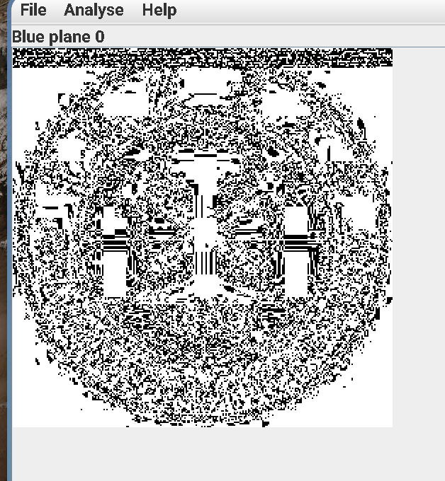
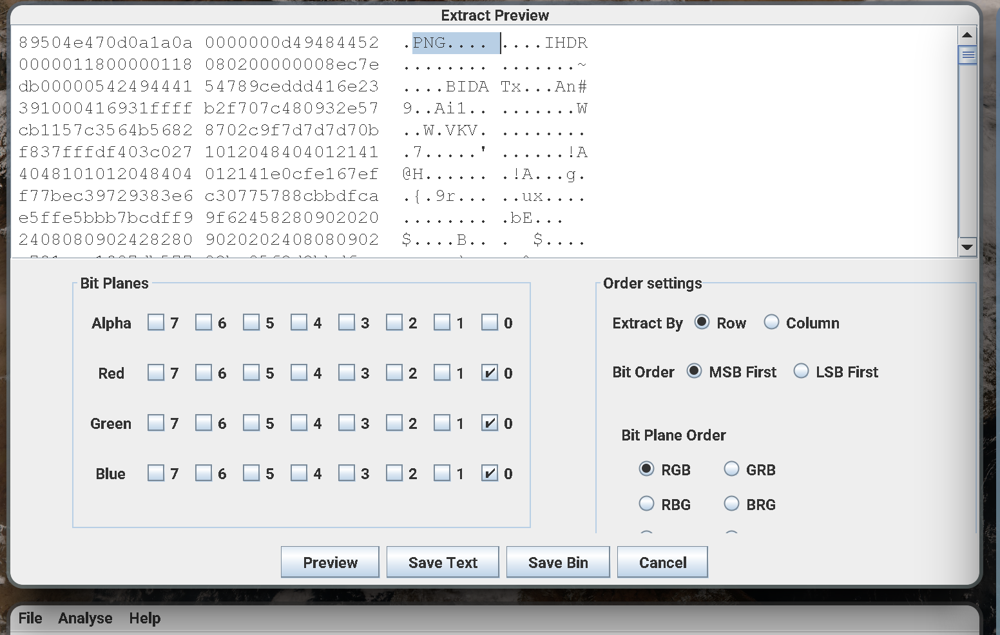
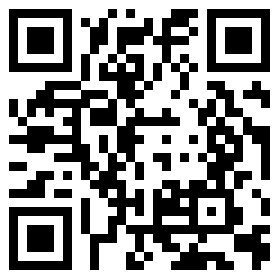

# buuctf LSB wp

附件压缩包内是一个图片。  
提示 LSB，LSB 即最低有效位，这道题是 LSB 隐写题，题目修改了RGB颜色分量的最低二进制位。  
一般使用 LSB 隐写分析工具为：StegSolve图片通道查看器。  
查看用方向键左右切换查看 Red plane 0、Green plane 0、Blue plane 0。



可以看到上方有一些东西。  
打开 Analyse->Data Extract。  
选择 Bit Planes 为 RGB 0 通道。  
查看文件头发现是 PNG。  


保存 (Save Bin) 为 png。  
发现是一个二维码：




用 zbarimg 识别即可得到 flag:
```
❯ zbarimg flag.png
QR-Code:cumtctf{1sb_i4_s0_Ea4y}
scanned 1 barcode symbols from 1 images in 0.01 seconds
```

## StegSolve 缩放调整
原先的 StegSolve 在我的 3k 屏上字非常小，它不会跟随系统的 DPI 缩放。因而要做额外的设置。  
在 `/bin/stegsolve` 是一个 shell 脚本。打开在 java 后面添加上：`-Dsun.java3d.uiScale=2.5` 即可修改缩放为 2.5 倍。  
具体脚本为：
``` bash
#!/bin/sh
exec java -Dsun.java2d.uiScale=2.5 -jar /usr/share/stegsolve/Stegsolve.jar "$@"
```
