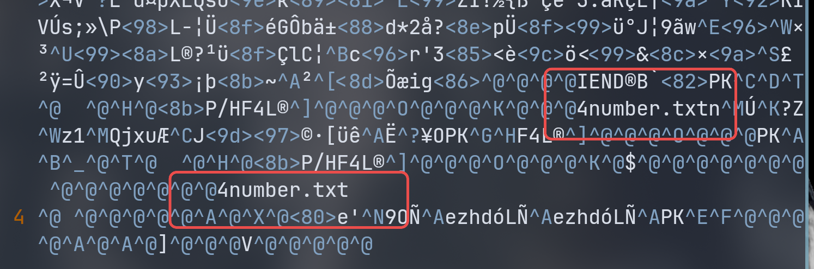

# buuctf 二维码 wp

附件是个二维码。  
用 `zarimg` 识别二维码出来：secret is here  
``` bash
❯ zbarimg QR_code.png
QR-Code:secret is here
scanned 1 barcode symbols from 1 images in 0.02 seconds
```

vim 打开 QR-Code.png 发现最后出现两个 4number.txt 字眼。  


考虑图片最后附带了压缩包。（图片能正常显示,但图片数据结束后粘了一个 zip/rar。    

用 [foremost](https://www.kali.org/tools/foremost/) 分离文件：  

``` bash
/data/project/ctf-repo/misc/buuctf/二维码 master*
❯ foremost QR_code.png
Processing: QR_code.png
�foundat=4number.txtn
Qjxu�J����[��˥OPF4L�
*|

/data/project/ctf-repo/misc/buuctf/二维码 master*
❯ tree output
output
├── audit.txt
├── png
│   └── 00000000.png
└── zip
    └── 00000000.zip

3 directories, 3 files
```

出来 000000.zip 。但是发现有密码。提示 4number 提示 密码长度为 4 个数字。  

用 [fcrackzip](https://www.kali.org/tools/fcrackzip/) 暴力破解 zip 密码。  
``` bash
/data/project/ctf-repo/misc/buuctf/二维码/output/zip master*
❯ fcrackzip -b -c '1' -l 4 -u 00000000.zip


PASSWORD FOUND!!!!: pw == 7639
```

得到密码为 7639。  
之后就拿到 flag 了。  
