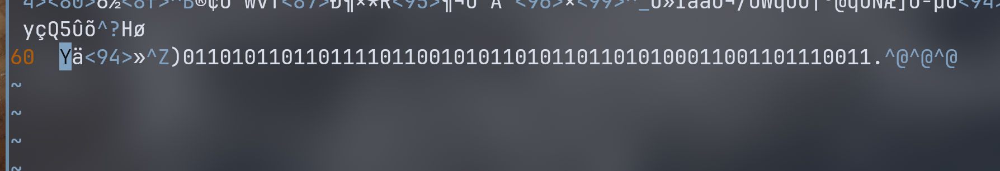

## buuctf 另一个世界 wp

附件是一个图片，vim 查看图片内容发现一串 0 1 字符串：  



`01101011011011110110010101101011011010100011001101110011` 可以尝试按字节截取，然后转换成 ASCII 码：  


``` python
a = "01101011011011110110010101101011011010100011001101110011"
a = "\n".join(a[i : i + 8] for i in range(0, len(a), 8))

b = ""

for i in a.split("\n"):
    b += chr(int(i, 2))
print(b)
```

这里有一个非常简洁的 python 表达式:  
``` python
a = "01101011011011110110010101101011011010100011001101110011"
a = '\n'.join(a[i:i+8] for i in range(0, len(a), 8))
```

其用来将最开始的二进制字符串按 8 个一组换行分隔。  

``` python
a[i:i+8] for i in range(0, len(a), 8)
```

这将返回一个生成器对象，输出为：
```
<generator object <genexpr> at 0x7f723d038580>
```

生成器对象是一个可以产生数据，迭代的对象。如果想要得到列表，可以加上 `[]` 或者在前面加上 `list()`:  
```python
[a[i : i + 8] for i in range(0, len(a), 8)]
list(a[i : i + 8] for i in range(0, len(a), 8))
```

往前面的 join 将其以某个字符串链接元素后形成新的字符串。  
```python
str.join(sequence)
```
这样输出为:
```
01101011
01101111
01100101
01101011
01101010
00110011
01110011
```


使用字符串的 spilt 方法分割字符串然后作 ASCII 转换就能得到 flag：`koekj3s`  

## 参考资料
1. [CSDN : python里什么是generator object](https://blog.csdn.net/haowunanhai/article/details/109000763)
