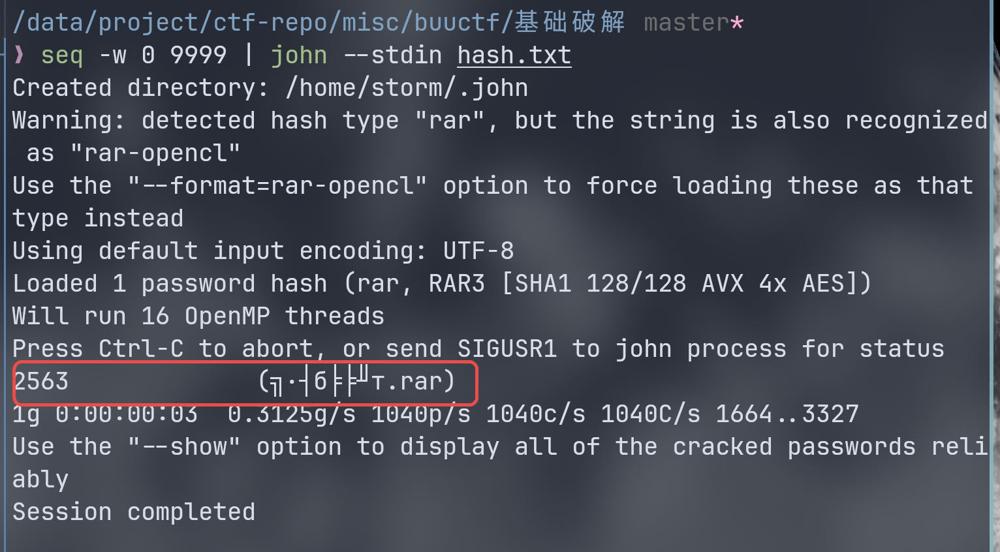

# buuctf 基础破解 wp

## 题面
给你一个压缩包，你并不能获得什么，因为他是四位数字加密的哈哈哈哈哈哈哈。。。不对= =我说了什么了不得的东西。。注意：得到的 flag 请包上 flag{} 提交

看来是 4 位纯数字

## 利用

附件解压后是一个 rar 文件：因为编码问题错乱了倒是。  
```
╗∙┤б╞╞╜т.rar
```
内容就是 flag.txt但有密码，需要破解。  
输出 hash 值
```
rar2john ╗∙┤б╞╞╜т.rar > hash.txt
```

john 破解
```
seq -w 0 9999 | john --stdin hash.txt
```


得到密码 2563。  

解压后 flag 是一串 ASCII 数，可能是 base64 加密。  

base64 解密拿到 flag：

```
❯ base64 --decode flag.txt
flag{70354300a5100ba78068805661b93a5c}
```
