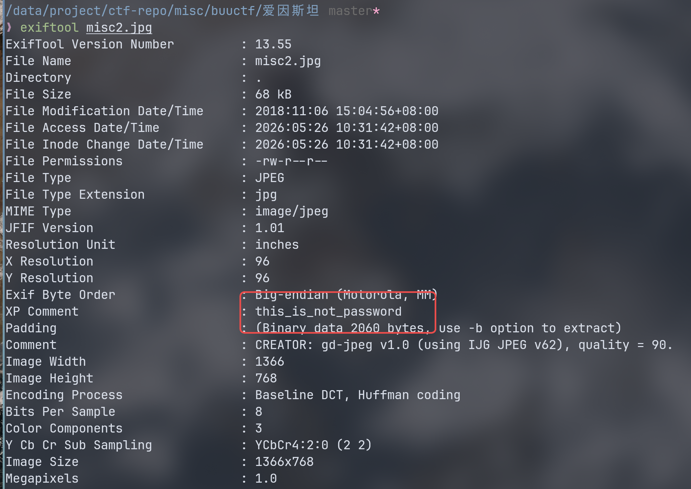
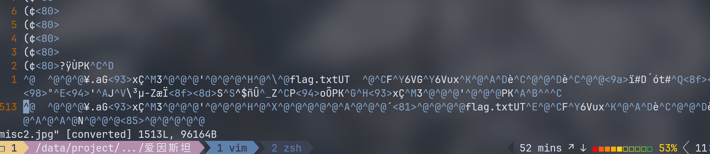

# buuctf 爱因斯坦 wp

exiftool 查看图片信息。  




XP Comment 有信息： this_is_not_password。  

password,难不成后面有压缩包？ vim 查看到最底下发现 flag.txt 的痕迹。  




用 foremost 分离：

```
❯ tree output
output
├── audit.txt
├── jpg
│   └── 00000000.jpg
└── zip
    └── 00000132.zip

3 directories, 3 files
```

出来有一个 zip,带密码。  
密码就是 `this_is_not_password` 。输入密码就是 flag.txt，完事。  
