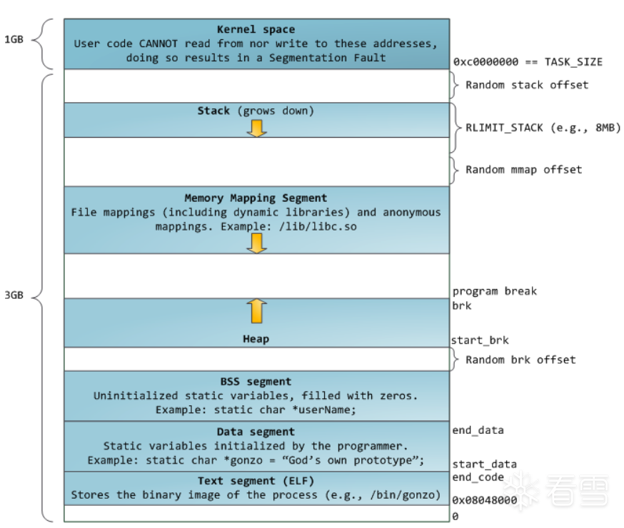
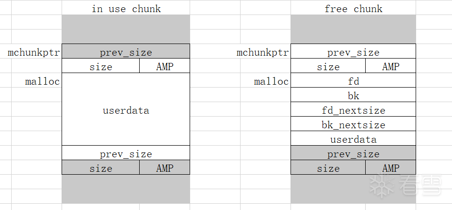
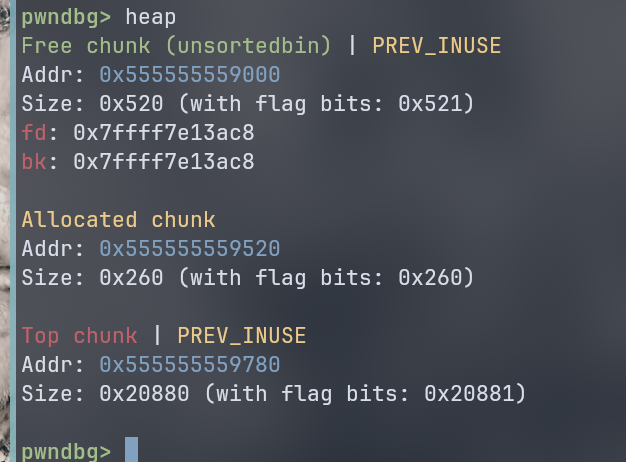
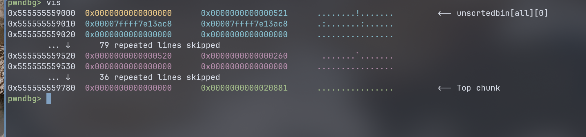
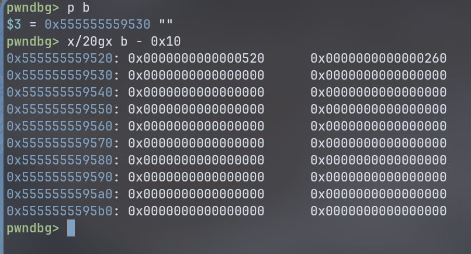
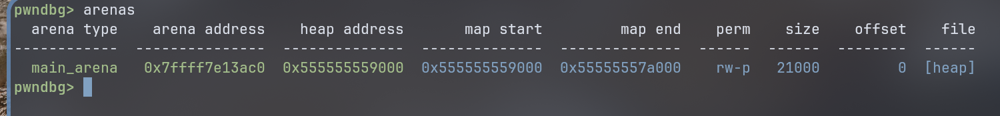
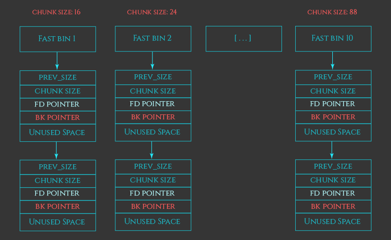
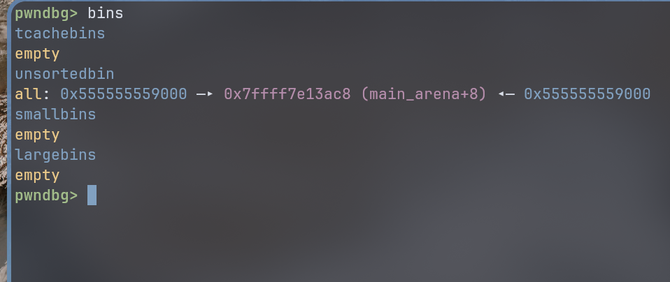

# 堆知识

## 基础
### 进程内存布局


### malloc_chunk 结构
`malloc_chunk` 是 glibc 用于管理堆内存的基本单元结构。每一块通过 `malloc` 分配出来的堆内存区域，其开头都带了一个 `malloc_chunk` 结构体。  

`malloc_chunk` 结构体定义：
``` c
#define INTERNAL_SIZE_T size_t   // 内部大小类型，通常为 size_t

struct malloc_chunk {
    // ----- 以下两个字段总是存在（无论是空闲还是占用） -----
    INTERNAL_SIZE_T      prev_size;  // 前一个 chunk 的大小（如果前一个 chunk 是空闲的）
                                     // 如果当前 chunk 的 size 字段中 PREV_INUSE 位为 0，
                                     // 则该字段有效，用于向前合并。
    INTERNAL_SIZE_T      size;       // 当前 chunk 的大小（包括元数据头部），低 3 位为标志位：
                                     // - PREV_INUSE (0x1): 前一个 chunk 是否在使用
                                     // - IS_MMAPPED (0x2): 是否由 mmap 分配
                                     // - NON_MAIN_ARENA (0x4): 是否不属于主分配区

    // ----- 以下字段仅当 chunk 空闲时才用于管理 -----
    // （被占用时，这部分空间完全属于用户数据，可被覆盖）
    struct malloc_chunk* fd;         // 前向指针，指向空闲链表（bin）中的下一个空闲 chunk
    struct malloc_chunk* bk;         // 后向指针，指向空闲链表中的上一个空闲 chunk

    // ----- 以下字段仅用于 large bins（大小 >= 512 字节的空闲块）-----
    // 用于在同一个 bin 中按大小排序，方便快速查找
    struct malloc_chunk* fd_nextsize; // 指向下一个不同大小的空闲 chunk
    struct malloc_chunk* bk_nextsize; // 指向上一个不同大小的空闲 chunk
};

typedef struct malloc_chunk* mchunkptr;  // 指向 malloc_chunk 的指针类型
```

当内存被使用时，元数据依然存在(但 fd/bk 部分被数据覆盖， prev_size 和 size 始终保留)  
堆上的每一块小区域（无论是空闲还是占用），它的开头必然存在一个逻辑上的 malloc_chunk 头部，用来描述这块区域的大小、状态和邻居信息。 



`size` 的低 3 位是标志位（A、M、P)。因为 chunk 的大小永远是 8 字节或 16 字节对齐的，所以低 3 位在表示真实大小时永远为 0，刚好可以用来存放标志。  

- **P(PREV_INUSE, bit 0)**：标记前一个 chunk 是否正在使用。如果 P=0，说明前一个 chunk 是空闲的，那么当前 chunk 的 prev_size 字段就有效（存着前一个 chunk 的大小），用来合并。
- **M (IS_MMAPPED, bit 1)**：标记这块内存是不是用 mmap 分配的。如果是，free 时会用 munmap 释放，不会走常规的堆管理逻辑。  
- **A (NON_MAIN_ARENA, bit 2)**：标记这个 chunk 属于非主分配区（即多线程下其他的 arena）。主要用于区分不同 arena 的锁和行为。  

每次读取 chunk 的实际大小时，会用掩码 `~(0x7)` (清除低 3 位) 来得到真正的长度。  

```c
size & 0x7 // 取标志位
size & ~0x7 // 取大小
```
### pwndbg 查看 chunk
- 使用 `heap` 查看 chunk：  
可以看到 chunk 的信息，包括 allocated chunk, free chunk。  



- 用 `vis-heap-chunks`  将堆的二进制数据可视化。  

  

除此之外，用原生 gdb 命令也可以比较好的看原始二进制数据。  
比如:
``` c
char* b = malloc(0x256);
```

可以查看 b 的地址为 0x555555559530 ，但是实际上前面 malloc_chunk 结构体(`prev_size`、`size`)还占据了前面 8 字节。  

使用 `x/20gx [addr]` 查看数据，如：  




## arena 
arena 表示单个线程维护的内存池。  
对于每个线程都会有着一个 arena 实例用以管理属于该线程的堆内存区域，包括 bins、fastbin 都是放置在 arena 结构体中统一进行管理的。  

在 glibc 中，用 `struct malloc_state` 结构体来描述 arena：  
```c
struct malloc_state
{
    /* 线程锁，用于多线程环境互斥访问该 arena */
    mutex_t mutex;

    /* 该 arena 的标志位，记录一些状态（如是否使用了 mmap 等） */
    int flags;

    /* Fast bins 数组，每个槽是一个单链表头，存放固定大小的小块空闲内存。
     * NFASTBINS 通常为 10，对应 16 字节到 80 字节（64位系统）的块。
     * Fast bin 中的块不会合并，以提升性能。
     */
    mfastbinptr fastbinsY[NFASTBINS];

    /* 指向 top chunk 的指针。top chunk 位于 arena 的顶端，
     * 当所有 bin 都没有合适大小的空闲块时，malloc 会从 top chunk 切割新块。
     */
    mchunkptr top;

    /* 最近一次从 large bin 或 unsorted bin 中分割后剩余的“余块”。
     * 用于优化连续申请小块内存时的缓存命中率，减少碎片。
     */
    mchunkptr last_remainder;

    /* 常规 bins 数组（双链表结构），总共有 NBINS 个 bin。
     * bin 0 未被使用，bin 1 是 unsorted bin，bin 2 ~ 63 是 small bins，
     * bin 64 ~ 126 是 large bins。
     * 数组每个 bin 实际需要两个指针（fd, bk），因此长度是 NBINS * 2 - 2。
     */
    mchunkptr bins[NBINS * 2 - 2];

    /* 位图，用于快速标示哪些 bin 非空，加速分配时对 bins 的扫描。
     * BINMAPSIZE 通常为 4（在 32/64 位下）。
     */
    unsigned int binmap[BINMAPSIZE];

    /* 指向下一个 arena 的指针，所有 arena 通过 next 字段连接成环形链表。 */
    struct malloc_state *next;

    /* 指向下一个空闲的 arena 链表，用于动态分配新 arena 时快速获取未使用的 arena。
     * (某些 glibc 版本中可能不存在或用途略有差异，但主流版本保留)
     */
    struct malloc_state *next_free;

    /* 当前 arena 正在服务的线程数量（包括主线程和子线程）。
     * 用于判断 arena 是否繁忙，决定是否创建新的 arena。
     */
    INTERNAL_SIZE_T attached_threads;

    /* 当前 arena 已向操作系统申请的总内存量（字节）。 */
    INTERNAL_SIZE_T system_mem;

    /* 系统内存的历史最大值，用于统计和调整。 */
    INTERNAL_SIZE_T max_system_mem;
};
```

### pwndbg 查看 arena 
用 `arenas` 查看 arena 数据：  

  


## `bin` 链表
| 类型         | 存储大小               | 结构                         | 分配策略 |
|--------------|------------------------|------------------------------|----------|
| fastbin      | 16~80 bytes (64位)     | 单链表                       | LIFO     |
| unsorted bin | 任意大小               | 双链表                       | FIFO     |
| small bin    | 固定大小(<= 512 bytes) | 双链表                       | FIFO     |
| large bin    | 范围区间(>= 512 bytes) | 双链表(带 nextsize 指针优化) | 最佳适配 |


### `fastbin` 
快速小内存回收复用，速度最优。  
由单链表实现  

fastbin 在 malloc_state 定义如下：  
```c
mfastbinptr fastbinsY[NFASTBINS];
```
`NFASTBINS` 



### `unsorted bin`
`unsorted bin` 相当于 `small bin` 和 `large bin` 的一个缓存，可以让 malloc 有第二次机会重新利用最近 free 的 chunk。  
只有一个 unsorted bin。  

### `small bin`
如果 `unsorted bin` 也无法满足需求，分配器就会进

### `large bin`

### `top chunk`
如果以上所有的 bin 都无法满足 malloc 请求，就会从 `top chunk` 上切割一块返回。  

### 用 pwndbg 查看 bin

用 bin 查看各种 bin  



也可以使用 `tcachebins`、`unsortedbin`、`smallbins`、`largebins` 查看每个类型的 bin。  

## 参考资料
1. [how2heap深入浅出学习堆利用 ](https://bbs.kanxue.com/thread-272416.htm)
2. [ 【CTF资料-0x0002】简易Linux堆利用入门教程by arttnba3 ](https://archive.next.arttnba3.cn/2021/02/24/%E3%80%90CTF%E8%B5%84%E6%96%99-0x0002%E3%80%91%E7%AE%80%E6%98%93Linux%E5%A0%86%E5%88%A9%E7%94%A8%E5%85%A5%E9%97%A8%E6%95%99%E7%A8%8Bby%20arttnba3/)
3. [Part 2: Understanding the GLIBC Heap Implementation](https://azeria-labs.com/heap-exploitation-part-2-glibc-heap-free-bins/)
4. [Cybersecurity - Notes Operations of the Fastbin](https://ir0nstone.gitbook.io/notes/binexp/heap/bins/operations-of-the-fastbin)
5. [pwndbg Documentation - vis-heap-chunks](https://pwndbg.re/stable/commands/glibc_ptmalloc2_heap/vis-heap-chunks/)
