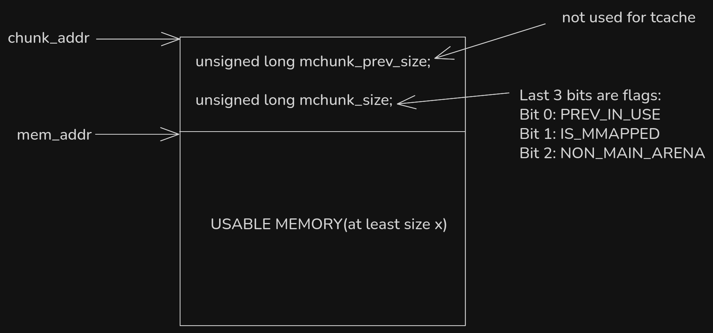

# Chunks and Metadata

metadata:
1. global metadata (i.e., the tcache structure)  
2. per-chunk metadata  

`malloc(n)` guarantees at least _n_ usable space, but chunks sizes are multiples of `0x10`.  

