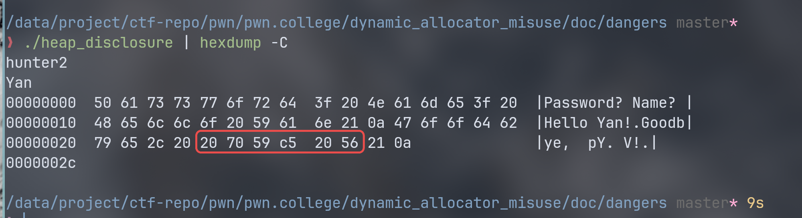

# dangers

- 滥用堆的方式：
    * 忘记释放内存
    导致内存泄漏
    * 忘记我们已经释放了内存
    导致使用或再次释放已经释放的内存  
    * **破坏分配器用于跟踪堆状态的元数据**  
    和各种栈溢出类似  

## 内存泄漏
一次内存泄漏的过程：
``` c
int main(int argc, char *argv[])
{
    int i = 0;
    char *a = "1";
    while (a)
    {
        i++;
        a = malloc(0x00000000);
        printf("Allocated: %p\n", a);
    }
    printf("%d\n", i);
    return EXIT_SUCCESS;
}
```


## Use After free


``` c
#include <fcntl.h>
#include <stdio.h>
#include <stdlib.h>
#include <string.h>
#include <sys/sendfile.h>
#include <unistd.h>

int main(int argc, char *argv[])
{
    char *user_input = malloc(8);
    printf("user_input address: %p\n", user_input);


    printf("Name?");
    scanf("%7s", user_input);
    printf("Hello %s!\n", user_input);
    free(user_input);

    long *authenticated = malloc(8);
    printf("authenticated address: %p\n", authenticated);
    *authenticated = 0;
    printf("Passwd?");
    scanf("%7s", user_input);

    if (getuid() == 0 || strcmp(user_input, "hunter2") == 0)
        *authenticated = 1;

    if (*authenticated)
        sendfile(0, open("/flag", 0), 0, 128);
    return EXIT_SUCCESS;
}
```

运行结果：
```
❯ ./heap_uaf
user_input address: 0x55bdecfe2010
Name?Yan
Hello Yan!
authenticated address: 0x55bdecfe2010
Passwd?not
flag{This_iS_a_f1ag}
```
内存被重新分配，导致 use after free 漏洞。  

## memory disclosure
一些堆实现重新使用被 free() 的内存来存储元数据。  

``` c
#include <assert.h>
#include <stdio.h>
#include <stdlib.h>
#include <string.h>

int main(int argc, char *argv[])
{
    char *password = malloc(8);
    char *name = malloc(8);

    printf("Password? ");
    scanf("%7s", password);
    assert(strcmp(password, "hunter2") == 0);
    free(password);

    printf("Name? ");
    scanf("%7s", name);
    printf("Hello %s!\n", name);
    free(name);

    printf("Goodbye, %s!\n", name);
    return EXIT_SUCCESS;
}
```

运行结果：



红框为一段内存地址……  

内存分配器元数据可以被写，不只是读而已。  

## The Rise of the Houses
a number of metadata corruption techniques:
- the house of prime
- the house of mind
- the house of force
- the house of lore
- the house of spirit
- the house of chaos
……  


