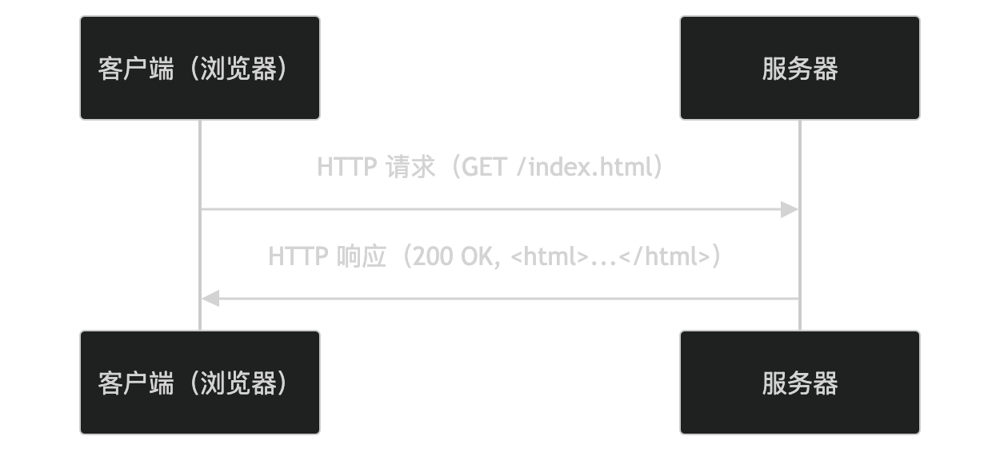
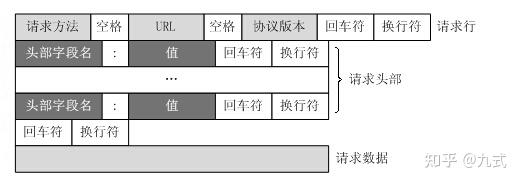
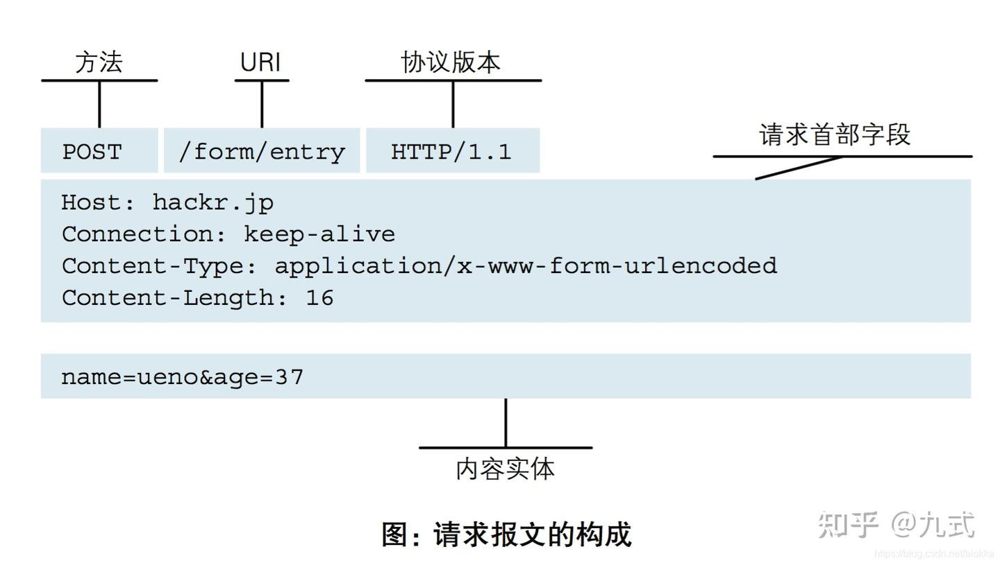
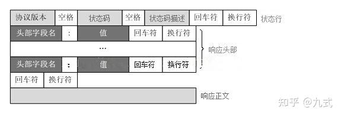
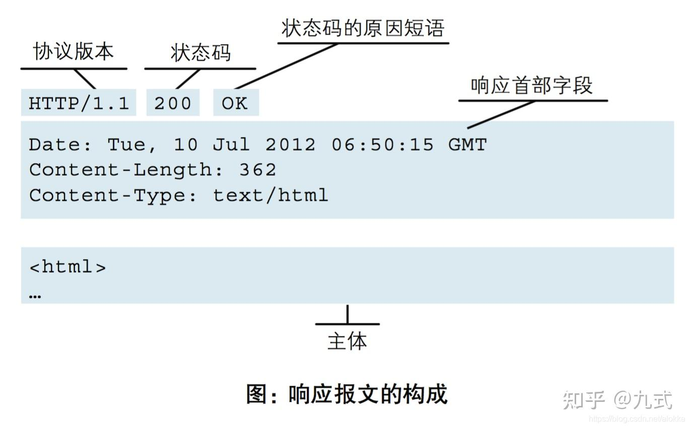

# 计算机网络基础

## http
HTTP 是 超文本传输协议(Hyper  Text Transfer Protocol) 的缩写。用于在客户端和服务器之间传输超文本，支持网页浏览、文件下载、API 调用等应用场景。  



- 客户端向服务器发送 HTTP 请求，比如 `GET /index.html`。  
- 服务器处理请求并返回 HTTP 响应，比如 `200 OK` 和网页内容。  

### HTTP 请求结构
1. 请求行：包括请求方法（如 GET、POST）、请求资源（如 `/index.html`）和协议版本（如 `HTTP/1.1`）。  
2. 请求头：包含附加信息（如 `Host`、`User-Agent`、`Accpet`）。  
3. 请求体：可选，用于传输数据，如 POST 请求的表单数据。  





    
## HTTP 响应结构
1. 状态行：包括协议版本（如 `HTTP/1.1`）状态码（如 200）和状态消息，（如`OK`）  
2. 响应头：包含附加信息（如 `Content-Type`、`Content-Length`）  
3. 响应体：包含实际数据，如 html 内容。  





## Content-Length
### application/x-www-form-urlencoded
普通表单提交，用 `&` 和 `=`  连接数据，不适合文件上传。  


### multipart/form-data 
用于文件上传。  
使用 `multipart/form-data` 时， HTTP 请求头必须指定一个分隔符 `boundary`。`boundary` 是一个随机字符串用来分隔不同的表单字段。  
``` http
Content-Type: multipart/form-data; boundary=----WebKitFormBoundaryABC123
```
请求体结构如下：  
``` http
--boundary
Content-Disposition: form-data; name="字段名"

字段值
--boundary
Content-Disposition: form-data; name="文件字段名"; filename="文件名"
Content-Type: 文件类型

文件二进制内容
--boundary--
```

### application/octet-stream
通用二进制流。  

## 参考资料
1. [HTTP 协议 | 菜鸟编程](https://www.runoob.com/np/http-protocol.html)
2. [一篇文章搞懂http协议(超详细）](https://zhuanlan.zhihu.com/p/676502895)
