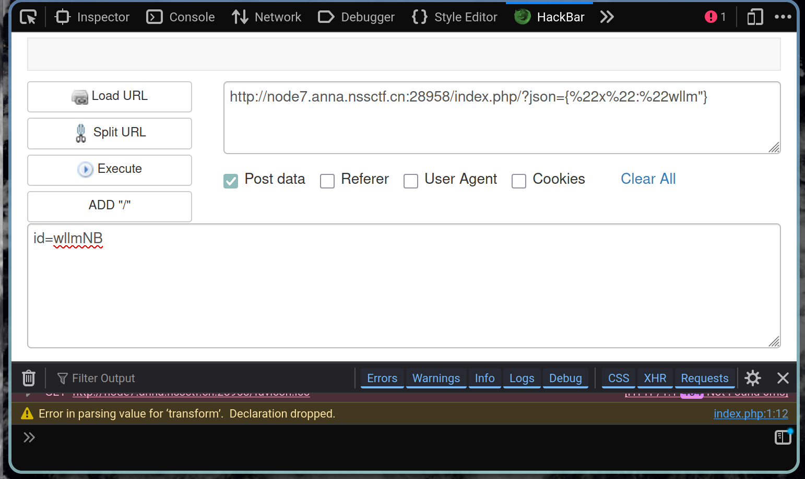

# nssctf jijiao wp
``` php
<?php
highlight_file('index.php');
include("flag.php");
$id=$_POST['id'];
$json=json_decode($_GET['json'],true);
if ($id=="wllmNB"&&$json['x']=="wllm")
{echo $flag;}
?>
```

网站进去就提供了 php 代码，可以进行分析。  

``` php
highlight_file('index.php');
```
将 index.php 高亮语法显示在浏览器上。  

``` php
include("flag.php");
```
包含外部文件 flag.php
该文件有变量 flag ，不会显示任何内容。  

``` php
$id=$_POST['id'];
```
从 HTTP 的 POST 请求中获取名为 id 的参数，存储在 $id 变量中。  

``` php
$json=json_decode($_GET['json'],true);
```
从 GET 请求中取得名为 json 的参数，将其作为 json 的字符串解析成为 PHP 数组复制给 $json 变量。
json_decode 的第二个参数为 true 表示返回关联数组，不传或者为 false 就会返回 stdClass 对象。  

``` php
if ($id=="wllmNB"&&$json['x']=="wllm")
{echo $flag;}
```

需要满足 $id 为 "wllmNB" 的同时 json 的 x 键要为 "wllm" 即可。  
需要同时传 POST 和 GET，用 hackbar 传 POST 请求。  
GET 请求在 url 传即可，后面加上`json={"x":"wllm"}`  
点击 Post data 输入 id=wllmNB 传 POST 请求。  
execute 后就会出现 flag。  


