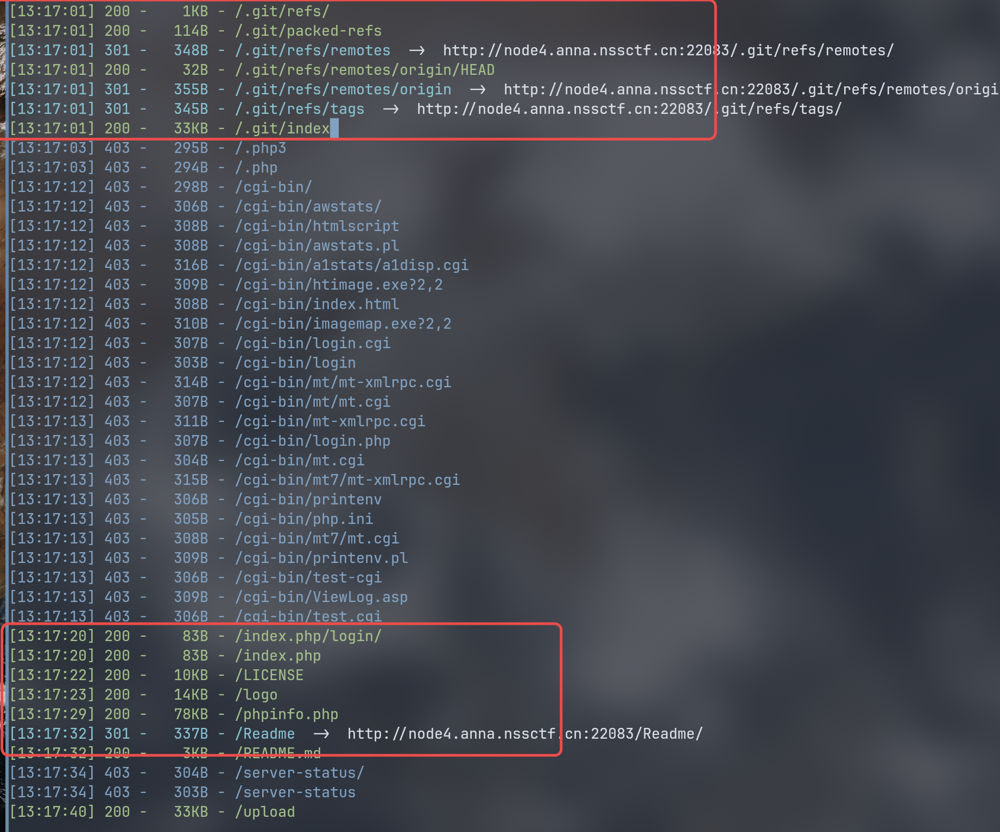
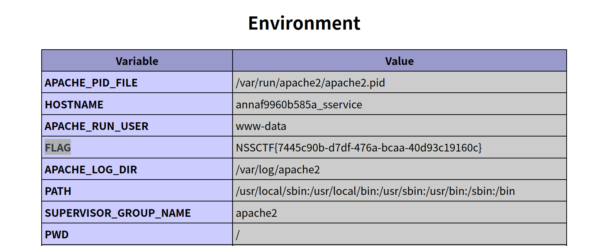

# webftp wp
打开网站看发现是一个登陆界面。  


用 [dirsearch](https://github.com/maurosoria/dirsearch) 扫描目录：



发现一大堆东西。先试试 git:
用 [GitHack](https://github.com/lijiejie/githack):
``` bash
python GitHack.py http://node4.anna.nssctf.cn:22083/.git/
```
最后发现是空仓库。  
再看看 phpinfo.php:
筛选 flag 发现 flag 项：




